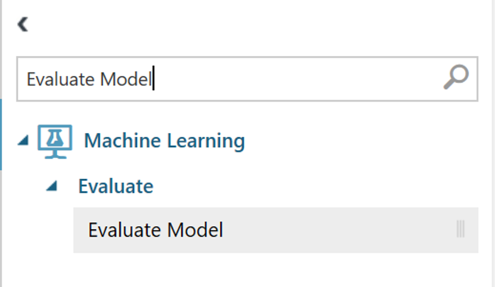

# MNIST Demo with Machine Learning Studio Designer tool

## Create a new experiment
1. Login [Azure Machine Learning Studio (classic)](https://studio.azureml.net)

2. The List on the left side of the window can be used to navigate between experiments, projects and other features in ML Studio. Click on **Experiment** tab and choose **+NEW** on the bottom left corner of the window. A pop-up window appears with various options to choose from. Please select **Blank Experiment** from the available options.

3. The left most panel contains various functions and models to choose from. The centre panel is to build the model and the right most panel shows the description of model or selected function. The name of the experiment can be changed by clicking on default name on the top “Experiment created on 7/4/2020” and type the required name in place of it.

## Demo Experiment
1. In this tutorial we will be running a demo experiment of predicting the handwritten numbers using Machine Learning Model. For this experiment we will be utilising the pre-defined data set available in Machine Learning studio under sample datasets.

2. From the drop-down list of **Samples** choose **MNIST Train 60K 28x28 dense**, click on the dataset and drag it on to the workspace in the centre, similarly choose **MNIST Test 10K 28x28 dense** and drag it on to the workspace.

3. Azure Machine Learning studio has several in-built functions that are used to perform pre-processing actions on the dataset itself which is discussed in the later section of the document. Now from left panel Choose from the in-built Machine Learning algorithms available under **Machine Learning** tab select Multiclass Neural Network and drag it on to workspace. In the same left panel search for **Train model** and drag into on to workspace. Similarly drag in **Score Model** and **Evaluate Model**.

4. Once the required functions are dragged and dropped on workspace, the tree diagram is connected as shown in the figure below.

5. Once the model is connected as above run click on the **Train module** function and from the right panel **Launch the column selector**. This step is to specify the response class for the Machine Learning algorithm to be applied on.

6. After the column selector window is open choose column **Label** and move it to adjacent list using the arrow keys as shown below.

7. Once the column is moved to Selected columns list click on the **Tick** mark on bottom right corner of the window to exit column selector. Now hit the **RUN** command on bottom centre of the page to execute the Machine Learning Model. Once the model is successfully executed a green tick marks appears in each of the function blocks showing the successful execution of each function.

8. The results of this experiment can be visualised by right clicking on the bottom white dot of **Evaluate model** tab.

9. Upon clicking Visualize the results of the model are displayed below:

### Pre-processing Functions
Azure Machine learning studio also supports user to perform several of pre-processing on the raw data before applying Machine learning algorithm. These pre-processing is done to improve the accuracy of the results and to make the model more compact and robust. Here in this tutorial we will be looking at splitting the data, cleaning the data and summarizing the data.

#### Importing data
1. Import data function is used to import data into ML studio. This function can be found in the left panel under Data input and output list, you can also navigate to it from search bar.

2. This function is dragged and dropped into workspace and Import wizard is opened from right panel.

3. This action will pop up a window on the screen to perform import action as shown below:

4. The source of the dataset can be selected from available options and the application will prompt the user proceeding steps to import the data. In this case we will be importing data from a .csv file in the local drive as shown in below (**+NEW > Dataset > Local drive**):

#### Splitting the data
1. Most of the times in production, user is not supplied with separate sets of data to train and test the model. Hence a split function is used to split the raw data into two parts one of which is used to train the model while the other is used to score the model while testing. Here to facilitate the split operation, default MNIST data has been downloaded to local drive and altered to add some irregularities in the data. Using the above described procedure, the altered dataset has been imported into ML Studio to perform splitting action.

2. Click on the Split Data function and navigate to the right panel to perform splitting action. The splitting mode, Fraction of splitting are specified as shown below.

> [**NOTE**: Here the splitting mode is based on rows due to the nature of dataset. The fraction of split is 0.7 which means 70% of data is split into first node (first white dot from left at bottom of split function) and rest of it is split into second node. It is an ideal practice to split data into 70% for train set and 30% for test set in general. More information about split function can be found in Microsoft help documentation]

3. As mentioned above the split data is now 70% into first node which will be used to train the model and 30% into second node which is used for testing. As a rule of thumb nodes in ML studio are always numbered from left.

#### Cleaning the missing data
1. In real time the data we deal with Machine learning always comes with blank or missing data points which if supplied as it is to ML algorithm can result in errors. Hence it is important to clean the missing data before processing it into ML algorithm. This action can be performed using in-built Clean missing data function in ML studio.

2. Once this function is dragged and dropped in the workspace the input node is connected to raw data that has missing values in it. Now the cleaning action can be performed from right panel as shown:

> [**Note**: In this case cleaning mode is chosen to be Remove entire row due to nature of data, but there are various other options available for cleaning modes which has their own performance benefits for different datasets. These can be referred in Microsoft documentation for cleaning data function]

#### Publishing the experiment
1. Once the ML model is executed successfully, the model can be published to Microsoft Machine Learning Gallery to share with public users. The project can be published by clicking the **publish icon** at the bottom of the screen.

2. This pops up a window as shown below where user can fill in the details and description of the experiment.

> [**NOTE**: In practice it is ideal to fill in detailed description of the experiment for other users and public to understand the experiment and its usage] 