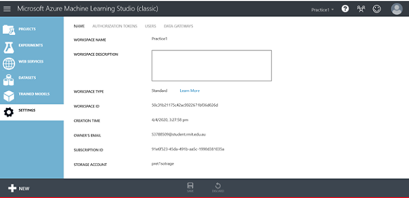
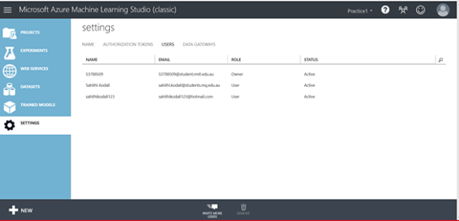

# Adding User to Workspace

In this tutorial we will teach you how to add user to workspace.

1. Go to settings tab on your workspace

2. Click on invite more users button at the bottom

3. Type in mail ID of user and click ok at the right bottom – Azure will send the mail to user to sign up

