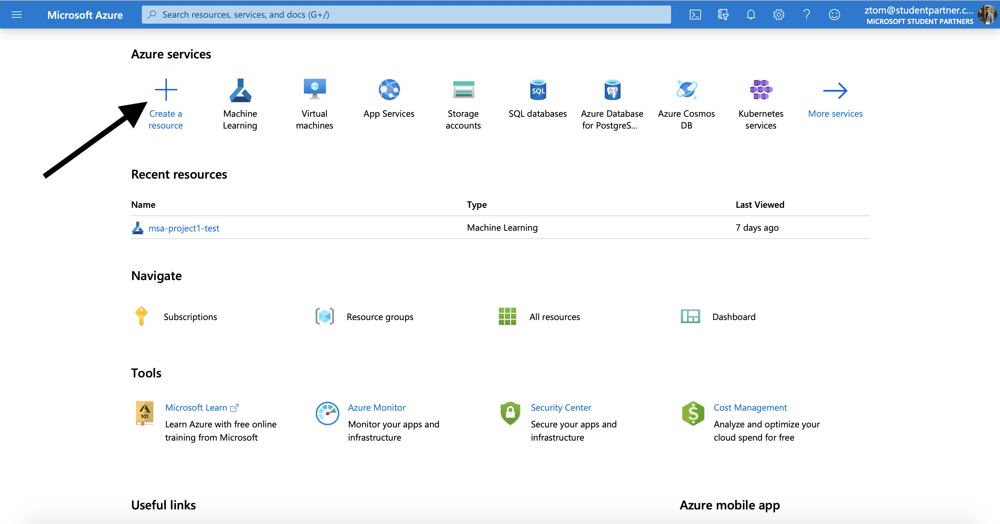
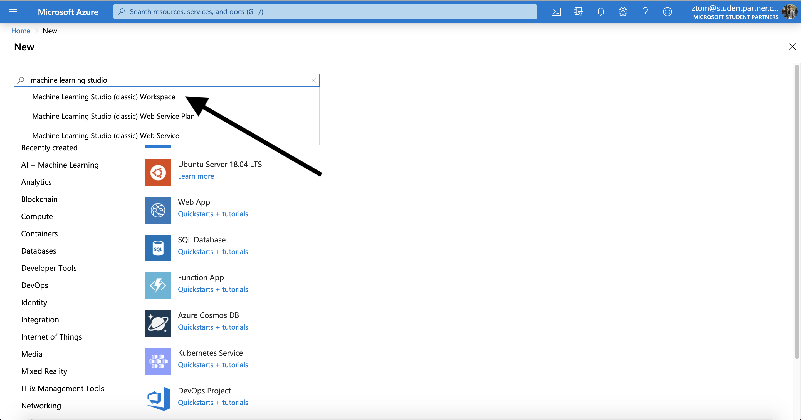
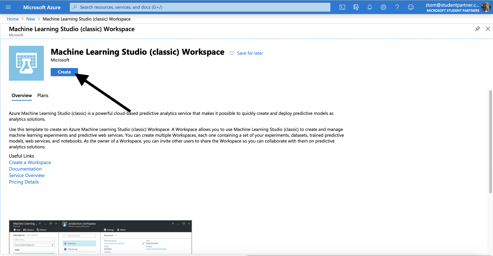
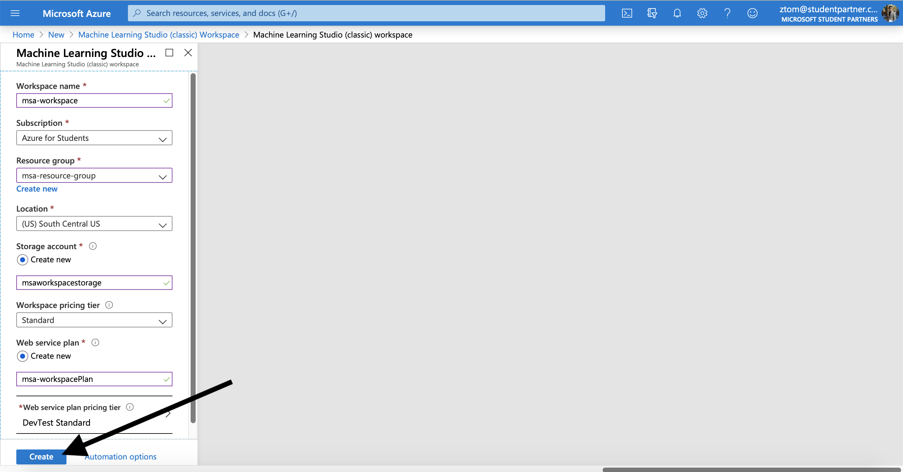
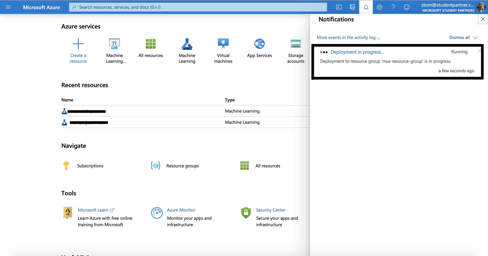
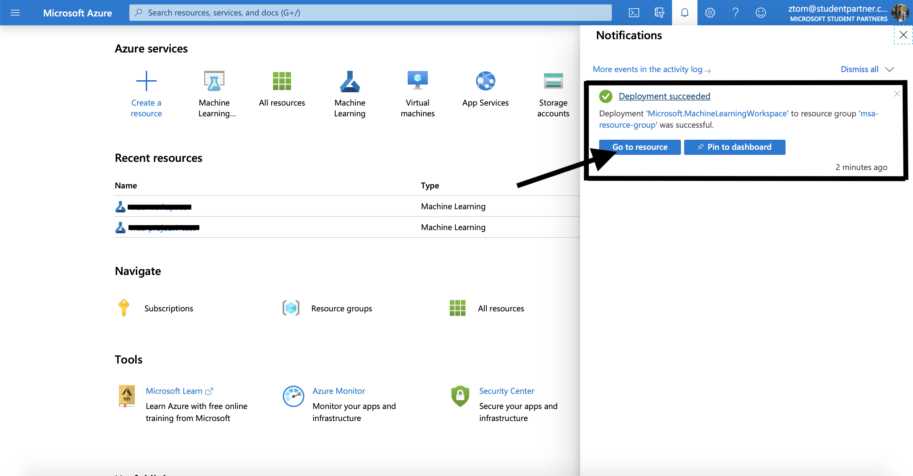
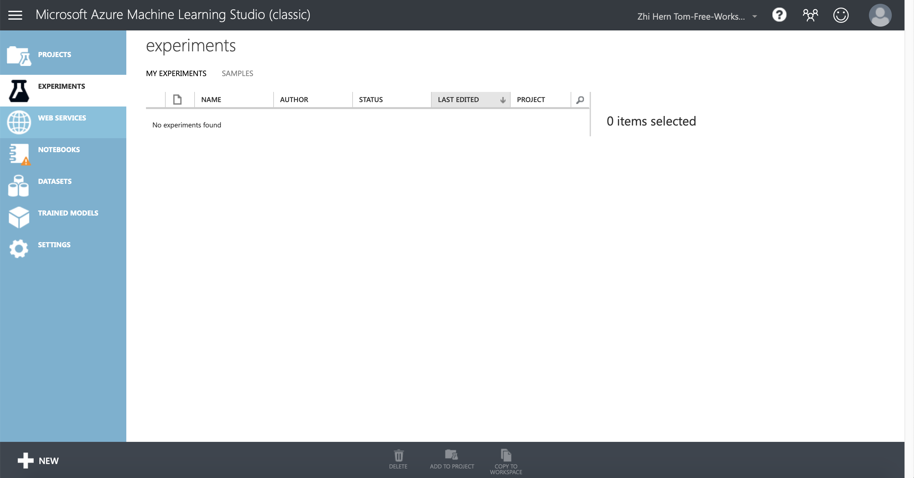

# Setting up Azure Machine Learning Studio
## Create a workspace
An Azure Machine Learning workspace is a foundational resource in the cloud that you use to experiment, train, and deploy machine learning models. It ties your Azure subscription and resource group to an easily consumed object in the service.

You create a workspace via the Azure portal, a web-based console for managing your Azure resources.

1. Sign in to [Azure portal](https://portal.azure.com/#home) by using the credentials for your Azure subscription.

2. In the upper-left corner of Azure portal, select + Create a resource.

3. Use the search bar to find Machine Learning and select **Machine Learning Studio (classic) Workspace**.

4. In the Machine Learning Studio (classic) Workshpace pane, select Create to begin.

5. Provide the following information to configure your new workspace. After you are finished configuring the workspace, select **Create**. **Please note that it can take several minutes to create your workspace in the cloud.**

6. Please wait for several minutes to create your workspace in the cloud.

7. To view the new workspace, select **Go to resource**.

8. To launch Machine Learning Studio, please select **Launch Machine Learning Studio (classic)**

9. Congratulations! You can now access your own Machine Learning Studio.
