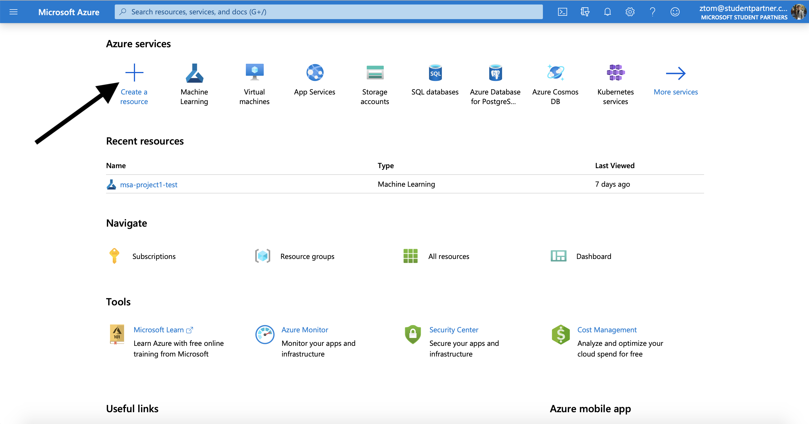
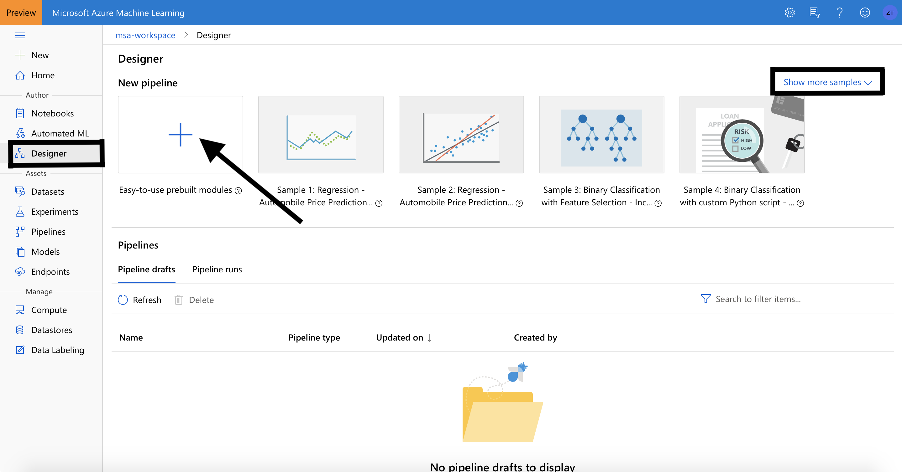

# Setting up Azure Machine Learning Studio
## Create a workspace
An Azure Machine Learning workspace is a foundational resource in the cloud that you use to experiment, train, and deploy machine learning models. It ties your Azure subscription and resource group to an easily consumed object in the service.

You create a workspace via the Azure portal, a web-based console for managing your Azure resources.

1. Sign in to [Azure portal](https://portal.azure.com/#home) by using the credentials for your Azure subscription.

2. In the upper-left corner of Azure portal, select + Create a resource.

3. Use the search bar to find Machine Learning and select **Machine Learning**.

4. In the Machine Learning pane, select Create to begin.

5. Provide the following information to configure your new workspace. After you are finished configuring the workspace, select **Review** + **Create**. **Please note that it can take several minutes to create your workspace in the cloud.**

6. To view the new workspace, select **Go to resource**.

## How to use sample pipeline
The designer saves a copy of the sample pipelines to your studio workspace. You can edit the pipeline to adapt it to your needs and save it as your own. Use them as a starting point to jumpstart your projects.

### 1. Open a sample pipeline
1. Sign in to ml.azure.com, and select the workspace you want to work with.

2. Select **Designer**, then select a sample pipeline under the **New pipeline** section. Select **Show more samples** for a complete list of samples.

### 2. Submit a pipeline run
To run a pipeline, you first have to set default compute target to run the pipeline on.
1. In the **Settings** pane to the right of the canvas, select **Select compute target**.

2. In the dialog that appears, select an existing compute target or create a new one. Select **Save**.

3. Select **Submit** at the top of the canvas to submit a pipeline run.

> Depending on the sample pipeline and compute settings, runs may take some time to complete. The default compute settings have a minimum node size of 0, which means that the designer must allocate resources after being idle. Repeated pipeline runs will take less time since the compute resources are already allocated. Additionally, the designer uses cached results for each module to further improve efficiency.

### 3. Review the results
After the pipeline finishes running, you can review the pipeline and view the output for each module to learn more.

Use the following steps to view module outputs:
1. Select a module in the canvas. 
2. In the module details pane to the right of the canvas, select **Outputs + logs**. Select the graph icon visualize icon to see the results of each module.
