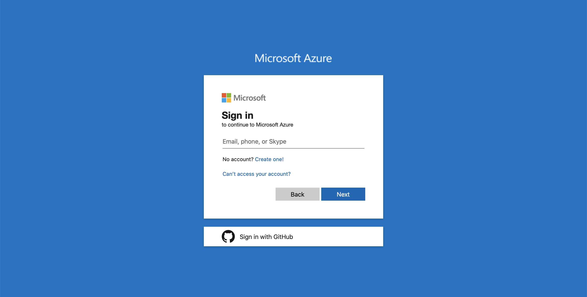
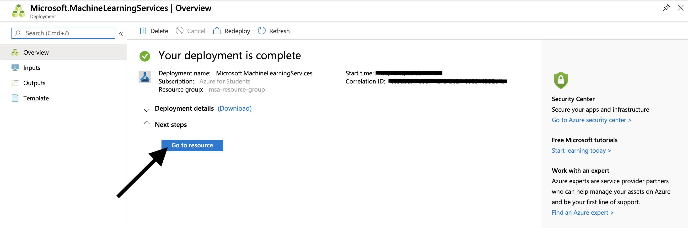
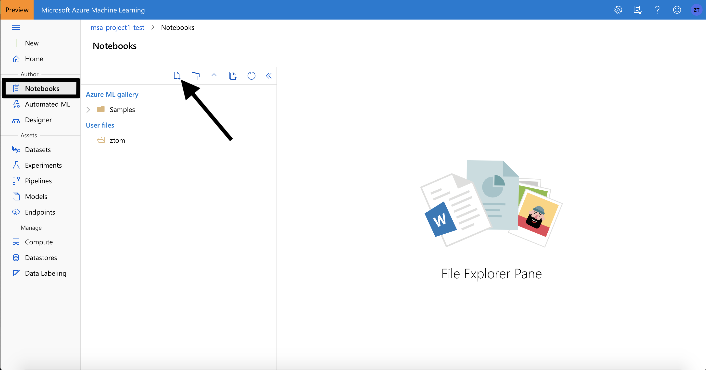
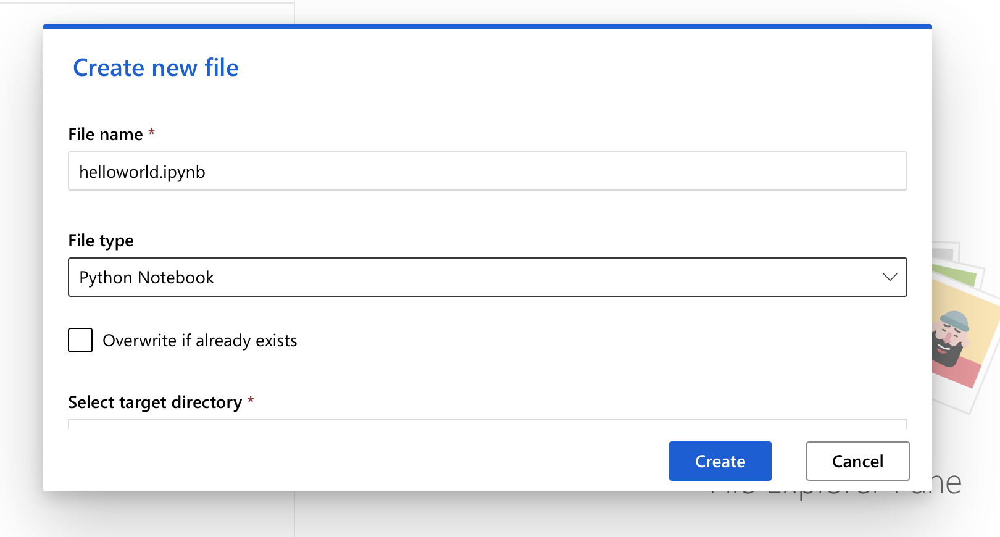
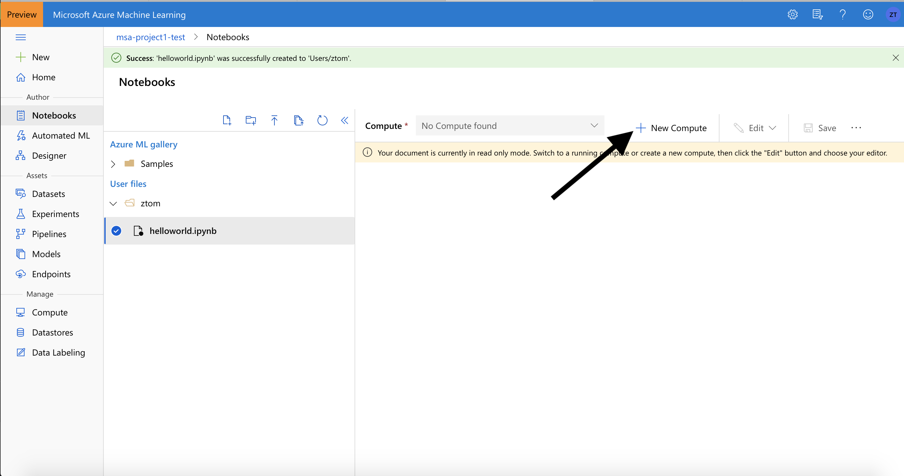

# Setting Up Azure Notebook

In this tutorial, you complete the end-to-end steps to get started with the Azure Machine Learning Python SDK running in Jupyter notebooks. This tutorial will cover Python environment setup and configuration, as well as creating a workspace to manage your experiments and machine learning models.

In this tutorial, you:
1. Create an Azure Machine Learning Workspace to use in the project.
2. Create a cloud-based compute instance with Azure Machine Learning Python SDK installed and pre-configured.

## Create a workspace
An Azure Machine Learning workspace is a foundational resource in the cloud that you use to experiment, train, and deploy machine learning models. It ties your Azure subscription and resource group to an easily consumed object in the service.

You create a workspace via the Azure portal, a web-based console for managing your Azure resources.

1. Sign in to [Azure portal](https://portal.azure.com/#home) by using the credentials for your Azure subscription.

2. In the upper-left corner of Azure portal, select + Create a resource.

3. Use the search bar to find Machine Learning and select "Machine Learning".

4. In the Machine Learning pane, select Create to begin.

5. Provide the following information to configure your new workspace. After you are finished configuring the workspace, select **Review ** + **Create**.
> **It can take several minutes to create your workspace in the cloud.**

6. To view the new workspace, select **Go to resource**.

## Run notebook in your workspace

1. Sign in to [Azure Machine Learning studio](https://ml.azure.com/).

2. Select your subscription and the workspace you created.

3. Select Notebooks on the left and click on the "create new file".

4. Provide the following information to configure your new file.

5. Click on the "Create new compute".

6. Follow the configuration shown in the picture below.

7. Wait for several minutes to get the new compute ready.

8. Once the compute is ready , click on the "Edit" and "Edit in Jupyter".

9. Then you are ready to use Jupyter notebook in your workspace.

