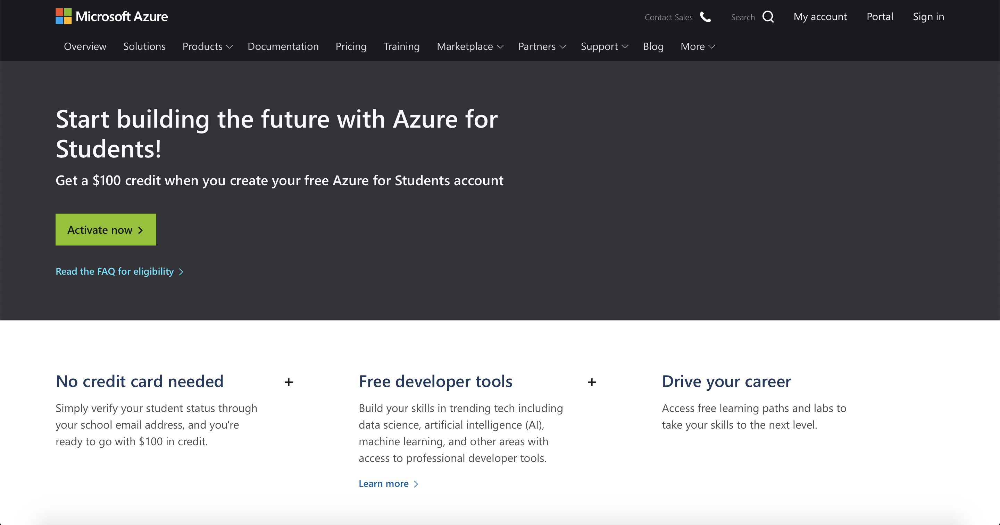
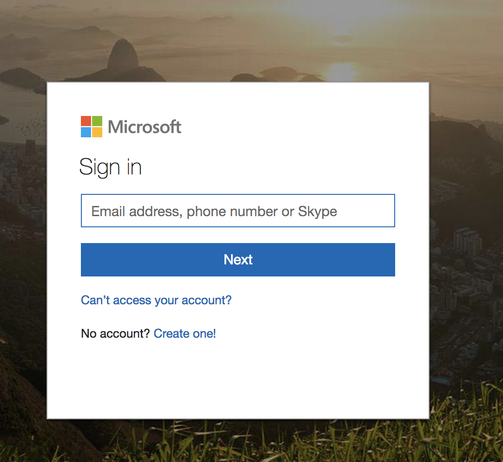
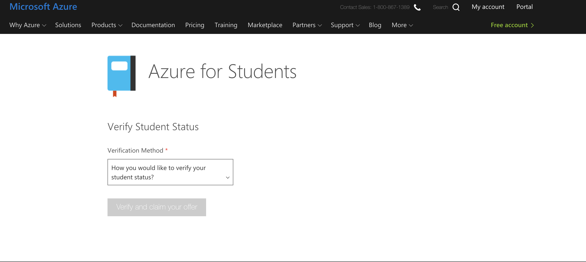
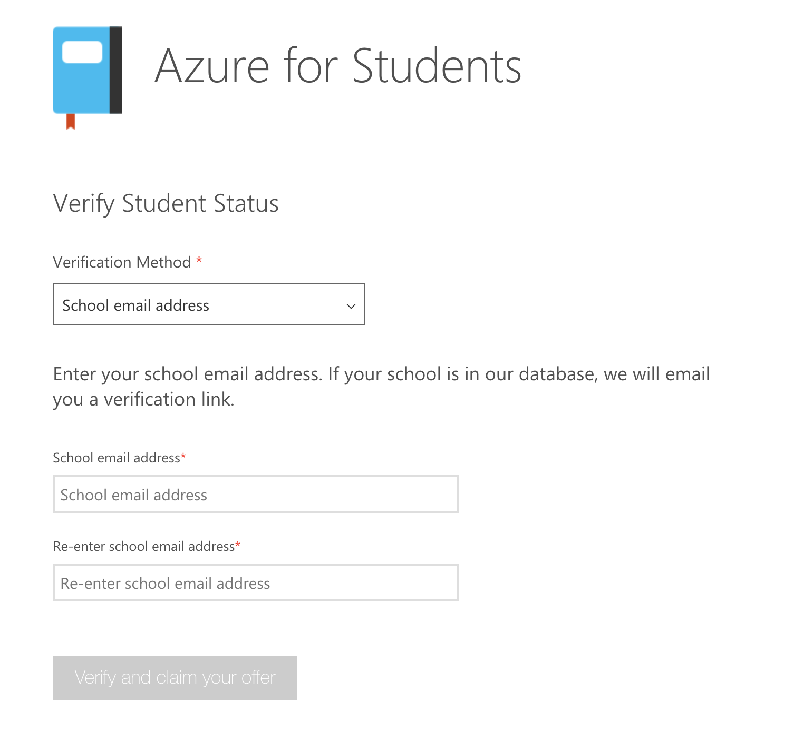
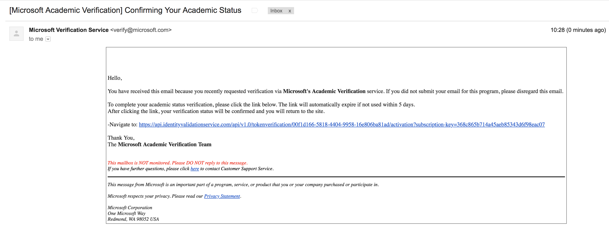
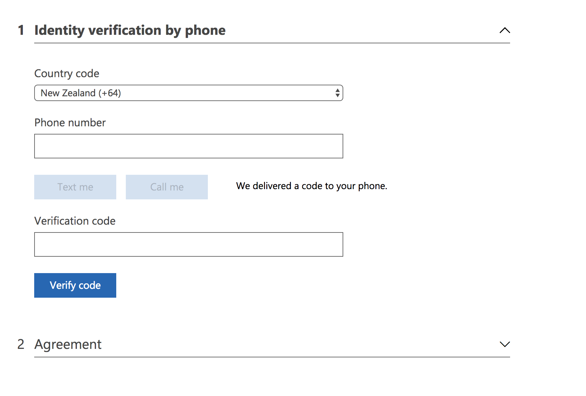
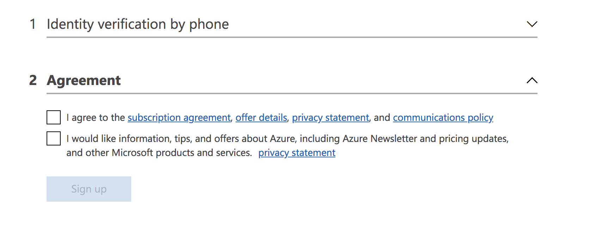
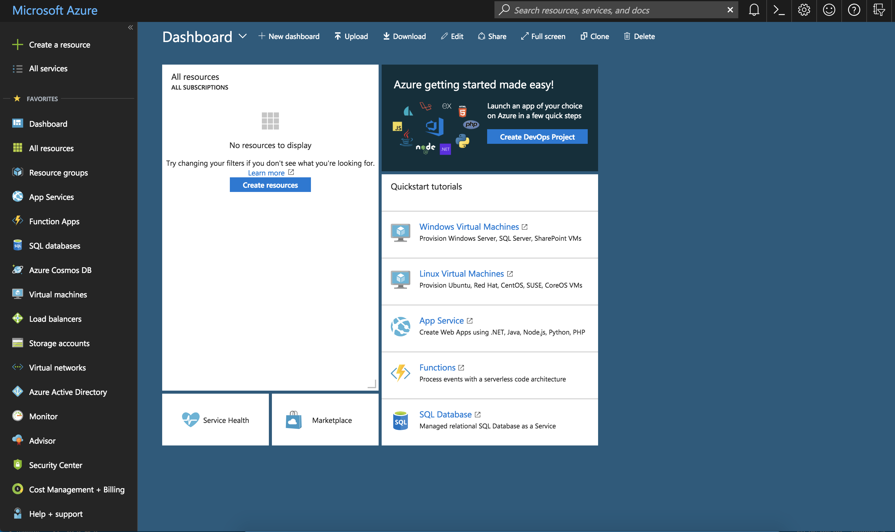
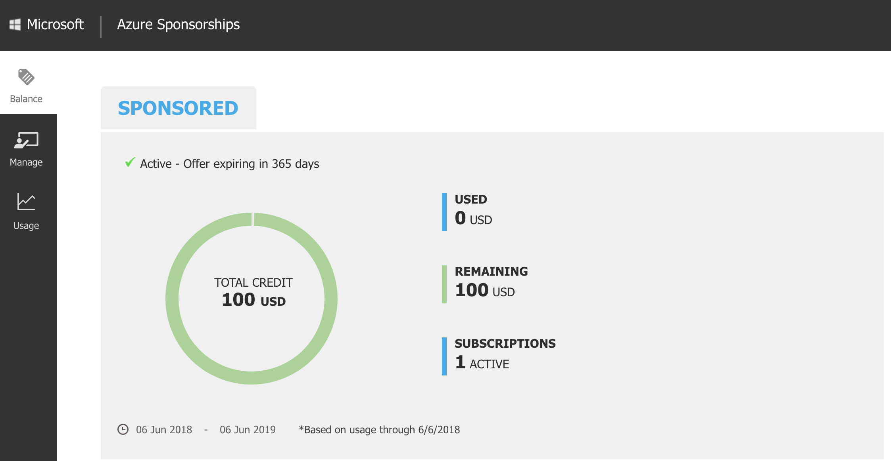

# 1. Azure For Students
## Introduction

Get a $100 credit when you create your Azure free account

## Getting started

Visit Azure For Students Home Page: 

https://azure.microsoft.com/en-us/free/students/

Click 'Activate Now'

Sign in with your existing microsoft account

Choose 'School email address' on the verification method drop down list.  

Enter your School email address and choose 'Verify and claim your offer'

You should receive an email like the one below, navigate to the link. 

Enter your phone number, you will recieve a verification code. Enter it in the respective text field. 

Once your code has been successfully verified, Read and accept the terms and conditions to proceed. 

 
After clicking 'Sign up' you will be able navigated to the azure portal home page. Go through the tutorial if you are new to azure to familiarise yourself with azure's capability. 

Visit [Azure Sponsorship Page](http://www.microsoftazuresponsorships.com) and click 'Check your Balance' to view your azure credit balance. 

# Congratulations

You have now successfully activated azure for students. 

