# Part 1 - Azure Notebooks
In this subsection we will learn how to set up and use Azure Notebooks to perform ETL. We will go through setting up a project and a notebook. We will upload a large dataset and within the created notebook we will use Python (however you can use Scala, R, or SQL if you prefer) to perform operations on it. We willsave our transformed dataframes to CSV which we can then use in Part 2 to connect to Power BI.

### Assessment (This will be covered in this tutorial)
- Please create a public project and submit the project link (just navigate and open your project and copy paste the link. Please be sure to test this link works by logging out and opening it or opening it in an incognito browser window)


\
Let's get stared!

## Contents
0. Find a dataset
1. What is Azure Notebooks?
2. Create a project in Azure Notebooks
3. Create a notebook
4. Upload a raw dataset
5. Set up the notebook
6. Read the raw dataset
7. Transformations
8. Create new table(s) with the cleaned data
9. Download the CSVs


# Let's get started

## 0. Find a dataset

As we will be manipulating a dataset, we first need to get one. I recommend signing up to Kaggle.com and looking through their collection of datasets. Find one which interests you and download its associated CSV file. You will need this in a later step.

## 1. What is Azure Notebooks? 

Azure Notebooks is a free service that provides Jupyter notebooks along with supporting packages for R, Python and F# as a service. Jupyter Notebook is an open-source web application that allows you to create and share documents that contain live code, equations, visualizations and narrative text. Uses include: data cleaning and transformation, numerical simulation, statistical modeling, data visualization, machine learning,and much more.

[The Azure Notebooks website has a FAQ section which answers a bunch of really useful questions](https://notebooks.azure.com/faq#top)


## 2. Create a project in Azure Notebooks

First we need to log into the Azure Notebooks portal at notebooks.azure.com. You'll need a microsoft account for this - create one if you need to.

Once you've logged in (and if you're logging in for the first time), you'll be prompted to create a user-id. Your user ID is used to access your profile and projects, and you'll need to submit your profile's URL for the assessment so choose one and click save.
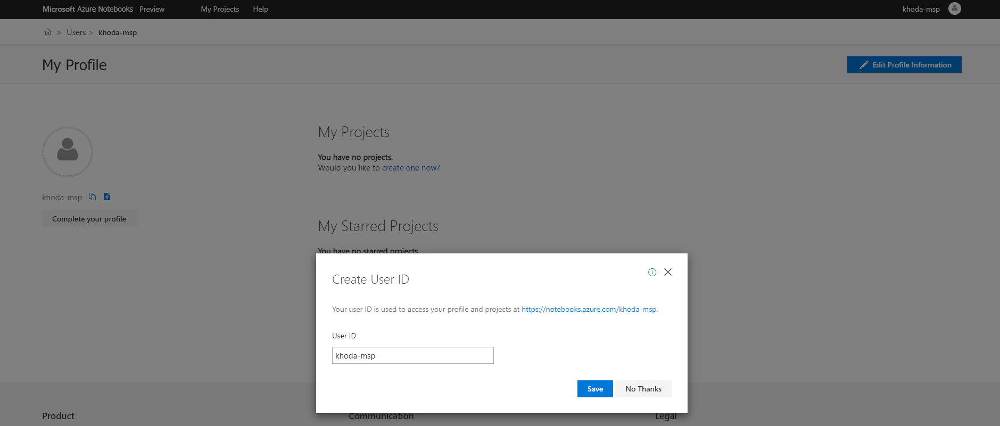

Under the "My Projects" title, click "create one now?" to create a new project. If you already have a project, click either on "SEE ALL" or "My Projects" at the top where it will take you to your existing projects and create a new one.

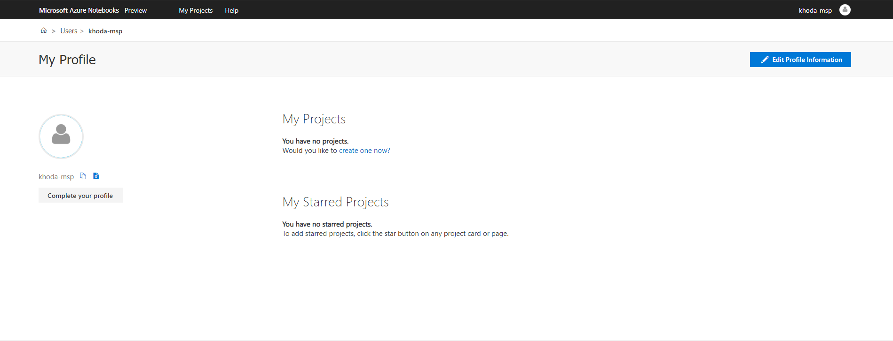

You'll be presented with a "Create New Project" dialog. Pick a project name and enter it in the field. Feel free to name it whatever you like. The Project ID will be created automatically as you type in your project name. Lastly ensure the "Public" check box is selected (so that we can view your project).


Once created you will be taken to the project. As I have the readme option ticked in the previous section, it has also been created and displayed.

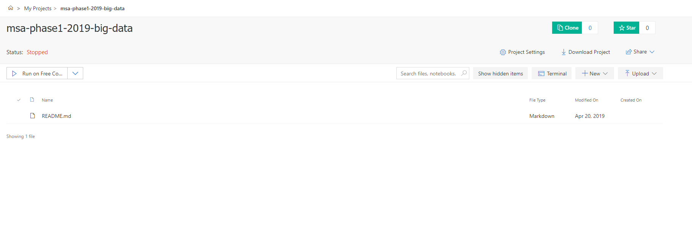

Think of your project like a git repository. You can add files and folders here and as it's public whoever navigates to your project can view and download the contents. CSV's you create later below will also appear here, as with the raw dataset which we will be adding.

Congratulations! You've successfully created your Azure Notebooks project.

## 3.  Create a Notebook

To create a notebook, click the new button and select notebook.


Enter in a name (can be any you like), and select a language. For this demo, I have selected Python. Click new.
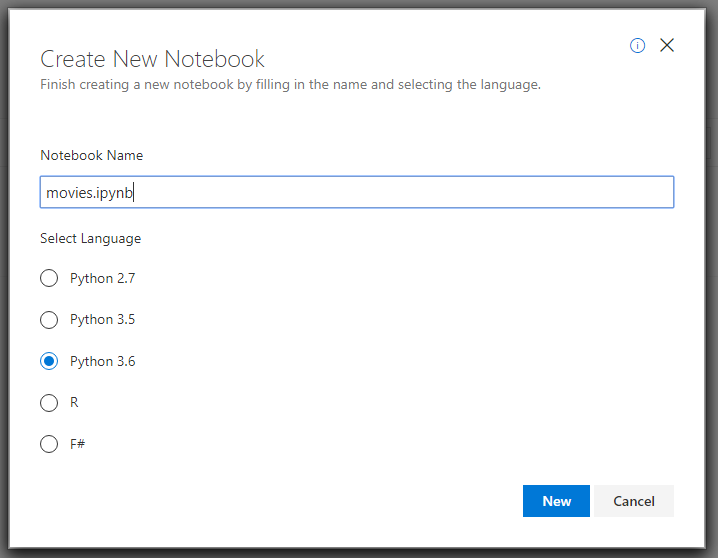

You should now see your new note book in your project.
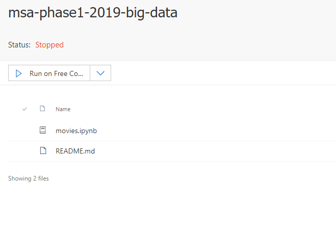

Lets click on the notebook to open it up. Upon opening you should see the following:
1: The Run button will run the current selected cell
2: This is a cell. You enter in your code here.
3: File menu item - you can use this to save or export your notebook. In here you can also upload and download files in your project.
4: The plus button will add cells to your notebook. Also to note, after running a cell (1), a new cell will be automatically created below.


## 4. Upload a raw dataset

Remember the dataset you saved from step 0? We'll need it now. In your opened notebook, click the File menu item and select upload.

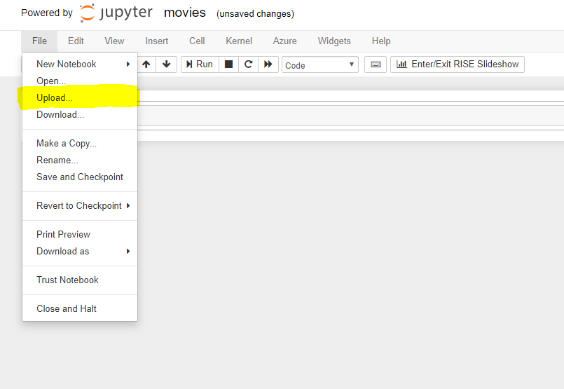

From the pop up dialog, select your chosen csv file. For this example, we will be using movies_metadata.csv (a copy can be obtained from [here](https://www.kaggle.com/rounakbanik/the-movies-dataset))

Once selected, change the destination folder from ~/ to /project. This will ensure your csv persists over time rather than just this session.

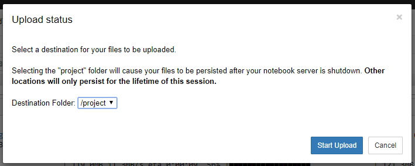

Click start upload. The status bar will be in green after a successful upload.

Your raw data has now been uploaded to your project.

## 5. Set up the notebook

Before we can start to do any transformations to our dataset - or even read that csv file we uploaded, we first need to configure some things in our notebook.

### Note following on, when entering code into the cells, dont forget to run the individual cells!

First we need to install the Pyspark library. Before i explain what this library does, we first need to understand what Spark is (Apache Spark). Apache Spark is a unified analytics engine for large-scale data processing. It is a popular open source framework that ensures data processing with lightning speed and supports various languages like Scala, Python, Java, and R. 

Pyspark is a Python API for Spark that lets you harness the simplicity of Python and the power of Apache Spark in order to tame Big Data. 

To install it, click on the first cell in your notebook and add the following:
```
!pip install pyspark
```

Now click the run button and wait for the notebook to do its thing.


You will know it is completely installed when you see the following
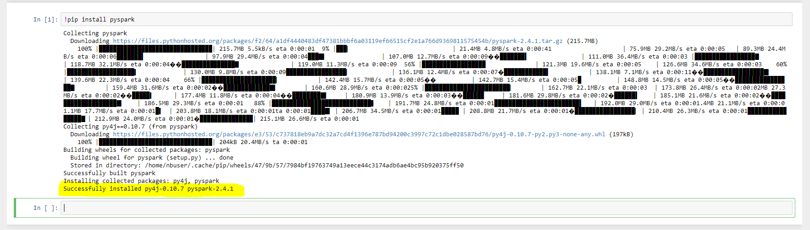


Once it's completed, we need to import a few modules.
1. `from pyspark.sql import SparkSession ` This is the Spark Session module. This module creates the entry point into Spark for our application. 
2. `from pyspark.sql.functions import * ` This adds modules which allow us to use things such as concat, when, col, udf etc. Im importing them all for simplicity, but ideally you'd just import the ones you need.
3. `from pyspark.sql.types import * ` These adds modules relating to type such as DateType, StringType etc. Once again im importing all for simplicity.

You cell should look like the following:
```
from pyspark.sql import SparkSession
from pyspark.sql.functions import * 
from pyspark.sql.types import *
```

Go a head and click run (while that cell is selected).

Now we need to create our spark entry point/session. To do this add the following code to a new cell and run it. You can name the appname whatever you like (for this demo i chose MSA Phase 1).

```
spark = SparkSession.builder.appName(name="MSA Phase 1").master("local[*]").getOrCreate().newSession()
spark
```

Once its complete it should return the AppName, version etc.

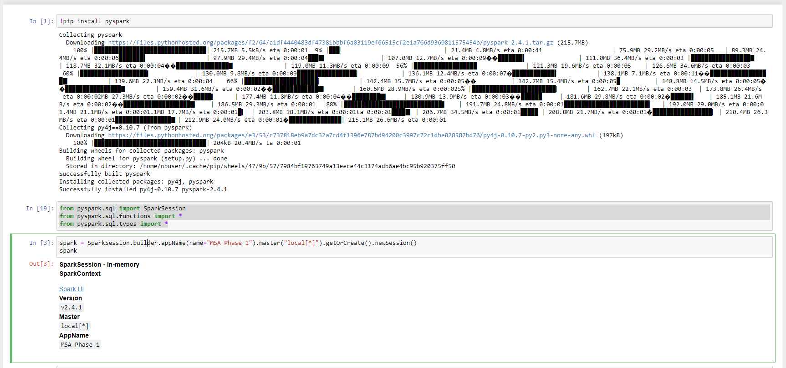

Our notebook is now set up and ready to use.

## 6. Read the raw dataset

To do manipulations, we first need to load our csv file with the raw data to a dataframe which we can then do operations on.

Next i'll read the movies metadata csv which we uploaded previously and save it to a dataframe.

```
# Read in the movie csv and store it into a dataframe.
movies = spark.read\
    .option("header", "true")\
    .option("inferSchema", "true")\
    .csv("movies_metadata.csv")

```

(Dont forget the run the cell)

We can view the schema of the dataframe we just created.

```
#this displays schema of the dataframe
movies.printSchema())

```

In order to view the content of our dataframe we need to convert it into Pandas. Pandas is another Python package such as Pyspark. The reason we are converting it to Pandas, is purely because it results in a nicer looking table view just in this case.

To do this, add the following to a new cell. We also add a limit of 10 rows to display. You can increase or decrease this number if you like.

```
movies.limit(10).toPandas()
```

Once run it should look similar to:
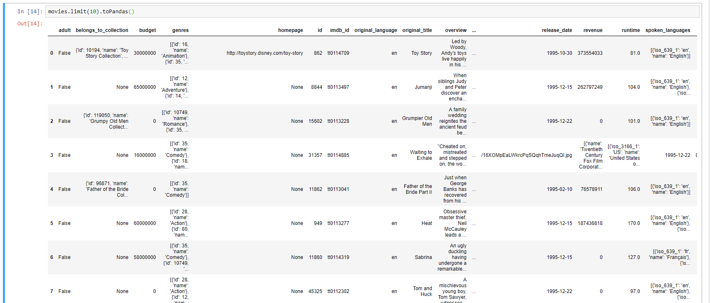

You can also find out the number of rows in your dataframe by running the following

```
movies.count()
```


## 7. Transformations

Transformations can be a variety of operations. For the assessment, we would like you to use three or more types of transformations. We will be covering five in this example.

So what are transformations? [This webpage](https://www.stitchdata.com/etldatabase/etl-transform/) bullet points a bunch of transformation types. We will be doing a wide range of transformations: Cleaning, Format Revision, Filtering, Splitting, Data Validation. 

After doing this process, what we want to end up with is three tables:
- Movies (transformed with some key columns of interest)
- MovieType (this links movie id and genre)
- MovieCompany (this links movie id and production company)

#### Filtering:

```
#Remove any non numerical runtimes
movies = movies.filter("runtime !=''")

#Remove any non numerical popularities
movies = movies.filter("popularity !=''")

```

#### Data Validation

Data validation is slightly more complex. What we will do is validate that all numerical columns contain numerical values only. There are a few steps to this. First we need to create a udf - user defined function.

```
def is_digit(value):
    if value:
        return value.isdigit()
    else:
        return False

is_digit_udf = udf(is_digit, BooleanType())

```

Followed by using this udf and some more filtering

```
# Remove any movies with no revenue
movies = movies.withColumn("revenue", when(is_digit_udf(movies['revenue']), movies['revenue'])).filter("revenue != '0'")

# Remove any movies with no budget
movies = movies.withColumn("budget", when(is_digit_udf(movies['budget']), movies['budget'])).filter("budget != '0'")

#Remove any non numerical ids
movies = movies.withColumn("id", when(is_digit_udf(movies['id']), movies['id'])).filter("id !=''")

```

#### Format Revision

Here we are converting the budget and revenue to NZD. The 1.46964 was the current exchange rate at time of writing. Other format revision examples, could be converting other units such as mile <-> kilometer etc.

```
# Convert Budget from USD to NZD
movies = movies.withColumn('revenue_nzd', movies["revenue"].cast("float") * 1.46964)

# Convert Revenue from USD to NZD
movies = movies.withColumn('budget_nzd', movies["budget"].cast("float") * 1.46964)
```

#### Cleaning

Here we are cleaning our date to an actual date type to maintain consistency.

```
# Convert the string to datetime
movies = movies.withColumn('release_date', movies["release_date"].cast(DateType()))
```

Looks good. But lets keep going. We've preped our columns to create our Movies csv, but we still need to do some more additional transformations to create our other two csvs - MovieType and MovieCompany

#### Splitting
If you look into the Genre column, you'll note its got json entries in here. What we want to do is explode this json, pull out all the genres for each movie, then create a new table which links movie to all its genres.

In order to explode the json entry, we need to state its schema. We can see it has a long for the genre id and a string for the name of the genre.

Then we create a new column which explodes the json, which we call genres_exploded. We then create another column called genre_name to get the genre names, from the exploded column. We have the data we need, so we can remove the genres_exploded using the drop command. 

Lastly we select the movie id column and our genre_name. We add an alias, so that the row is called genres and we save this all to a new dataframe called genre. The below code reflects what i described above. I've added a display line, so you can see the resulting.

```
# Create a table which maps genres to movies
genres_schema = ArrayType(StructType([StructField("id", LongType()),StructField("name", StringType())]))

# Explode the column, get what we need and save this to a new dataframe
genre = movies\
  .withColumn("genres_exploded", explode(from_json("genres", genres_schema)))\
  .withColumn("genre_name", col("genres_exploded.name"))\
  .drop("genres_exploded")\
  .select("id", col("genre_name").alias("genres"))

genre.limit(10).toPandas()
```

We have created the dataframe we need to create the MovieType table we need. Saving this as a csv is covered in the next section.

Output should look like:
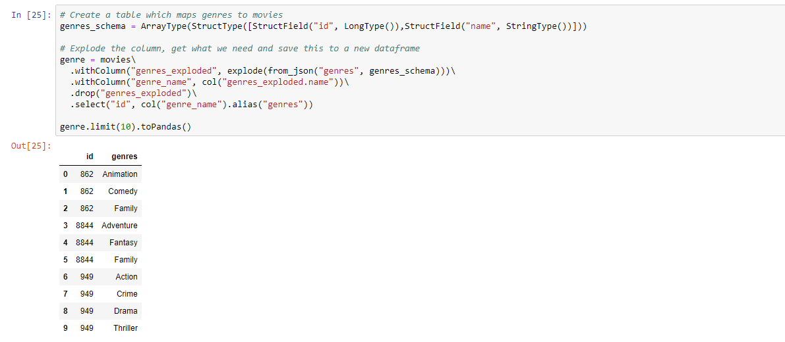

Lets now do the same to create the MovieCompanies dataframe.

```
# Create a table which maps production companies to movies
companies_schema = ArrayType(StructType([StructField("id", LongType()),StructField("name", StringType())]))

companies = movies\
  .withColumn("companies_exploded", explode(from_json("production_companies", companies_schema)))\
  .withColumn("production_company_name", col("companies_exploded.name"))\
  .drop("companies_exploded")\
  .select("id", col("production_company_name").alias("production_companies"))

companies.limit(10).toPandas()

```

## 8. Create new CSV(s) with the cleaned data

We are almost all done. But there is one more thing we need to do to our data. Dataframes are temporary. We need to save these results to CSV's back into our project, so we can download them and use them in Power BI. Lets do this now.

In a new cell add the following and run.
```
genre.coalesce(1).write.csv('movieType.csv',header = 'true')
```

What this does, is it gets the genre dataframe we created earlier, and writes it to a csv, including our column headers. The .coalesce(1) ensures that we only end up with a single csv file (without this you may get 1 or more csv's which you would then need to combine)

This csv will be living in our project, which we can later download.


We also need to save the cleaned movie companies dataframe. The code is similar, but we change it to use the comapanies dataframe we created earlier and we ensure to select a different name. Add the following and run.

```
companies.coalesce(1).write.csv('movieCompany.csv',header = 'true')
```

Awesome, so these two cells will create our two genre and company csv's. But there is one last csv we need to also create. This is our movie dataframe, with our transformed data.


First lets pick and display the columns we want to use in Power BI (we already decided this in earlier steps, which is why we cleaned the columns we did). The following selects the specific columns in our movies dataframe and displays it.

```
movies.select("id", "title", "budget_nzd" , "revenue_nzd", "popularity", "runtime").limit(10).toPandas()
```

By running the above cell we can view what our csv will look like.

Awesome, now lets save this dataframe to a csv. To do this add the following code:

```
movies\
.select("id", "title", "budget_nzd" , "revenue_nzd", "popularity", "runtime")\
.coalesce(1).write.csv('movies.csv',header = 'true')

```

Run the cell. 

Woo hoo! Hopefully all the csvs have been created.

## 9. Download the CSVs

So how do we download the created CSV's? Easy, click the File menu on the top left (when youre in the notebook), and select download. Now click on project and then select the three csv files. (These are actually folders which contain the csv inside which you will need to rename). 

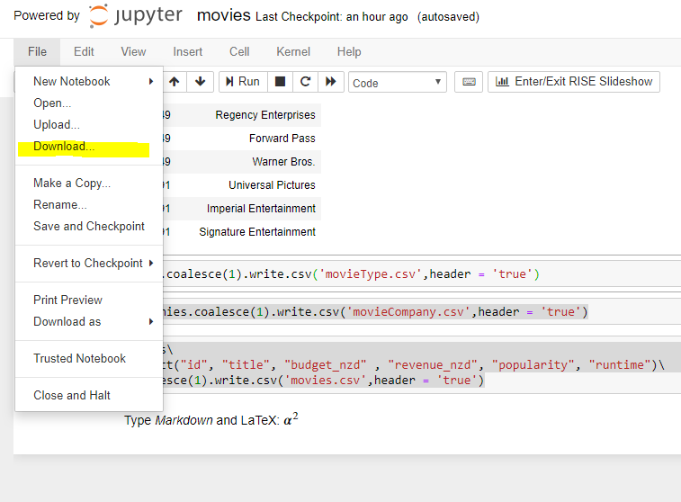

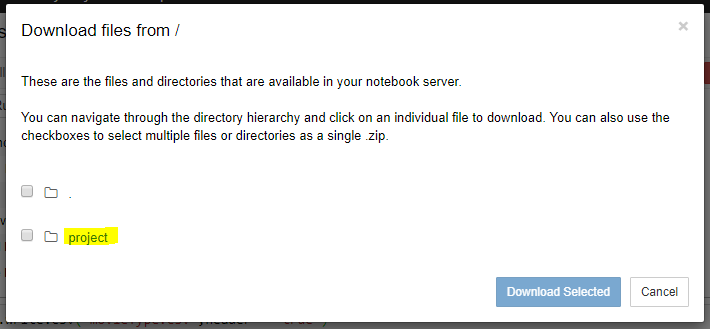


You can also download them from the project view too. 

### Completed demo project
You can find the notebook with all the code and cells in [this link](https://msaphase12019bigdata-khodamsp.notebooks.azure.com/j/notebooks/movies.ipynb)

The project link is [this](https://notebooks.azure.com/khoda-msp/projects/msa-phase1-2019-big-data)

### To continue your work next time:
If you stop working on your notebook and log out, next time when you come back to your notebook, you will need to rerun each of the cells. This is because it runs in memory and the memory will be cleared. You wont need to reupload your raw dataset if you have saved it in your project as per the steps in this tutorial.
