# Setting Up WordPress

## Prerequisites
An Azure subscription. If you don't have an Azure subscription, [create a free account](https://github.com/AUMSA/2020-MSA-content/tree/master/Azure%20For%20Students) before you begin.

## Setting up WordPress:
1.	Sign in to the Azure portal.

    

2.	Click on the create resources.

    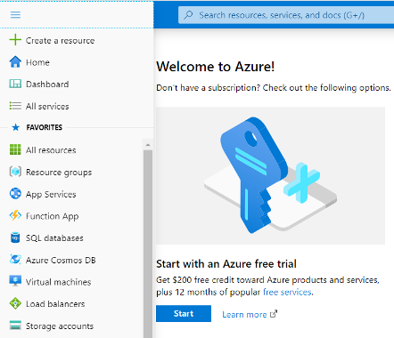

3.	This option takes you to the Azure Marketplace.

    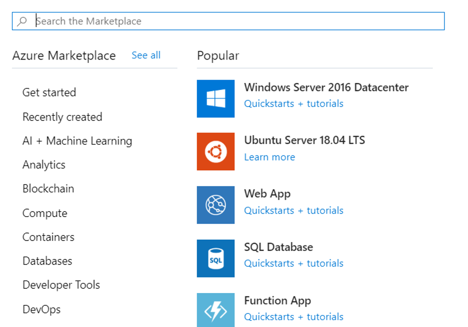

4.	The Azure Marketplace has many services, solutions, and resources available for you to use. Since we know that we want to install WordPress, we can do a quick search for it. In the Search the Marketplace box above the listed application options, type in WordPress. Select the default WordPress option from the list of options available.

    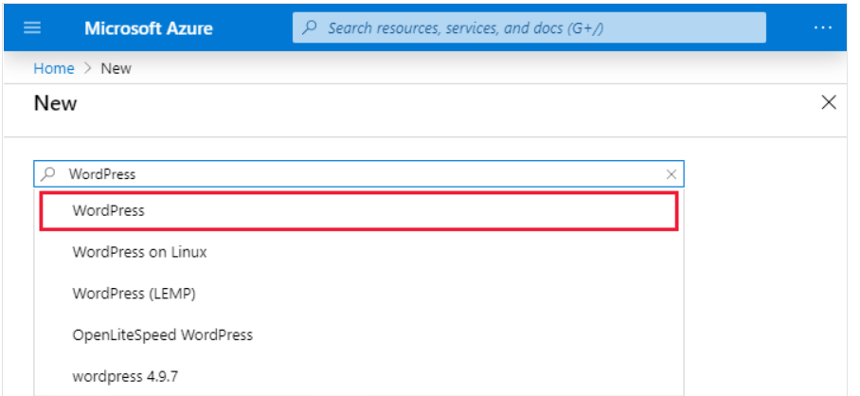

5.	In the newly presented panel, you'll typically find additional information about the item you're about to install, including the publisher, a brief description of the resource, and links to more information. Make sure to review this information. Select Create to begin the process to create a WordPress app.
    

6.	Next, you're presented several options to configure your deployment. Enter the following information:
    - **App Name**: Choose a unique value for the App name. It will form part of a Fully Qualified Domain Name (FQDN).
    - **Subscription**: Make sure the Azure for students is selected.
    - **Resource Group**: Select the create new radio button.
    - **Database Provider**: Select Azure database for MySQL in App.
    - **App Service plan/location**: In the App Service plan panel, select Create new.

    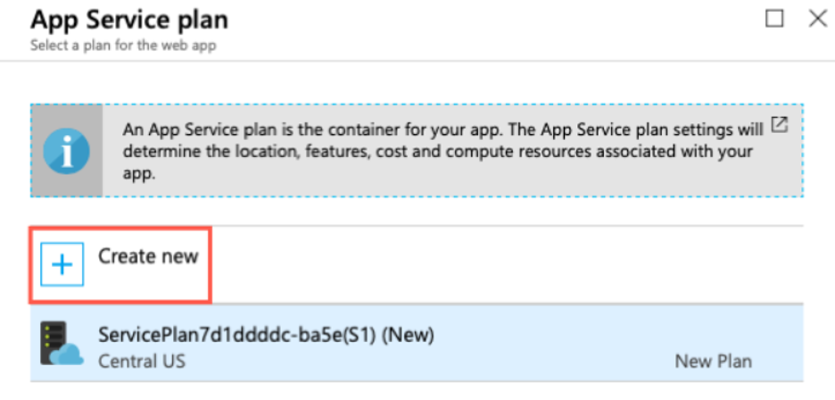
 
    - In the New App Service plan panel, enter a name for the new service plan.
        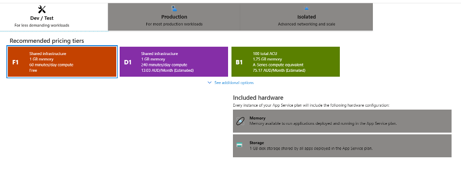

    - For Location, pick Central US to make sure we pick a region that allows the service plan you will pick. Normally, you would pick the region that is closest to your customers while offering the services you need.

    - Select Pricing tier to see the performance and feature options of the various types of service plans. Select the Dev / Test tab and select the F1 pricing tier. Then select Apply.

    

    - Your fields will look like this

    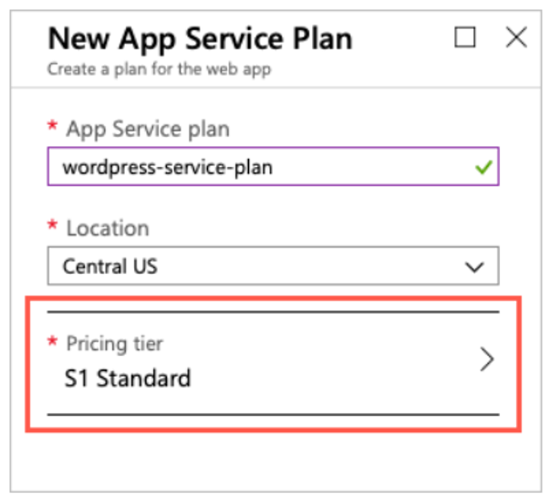

    - **Database Settings**: Click on the field and select a password for your database. Make sure you are noting down the details for future use.

    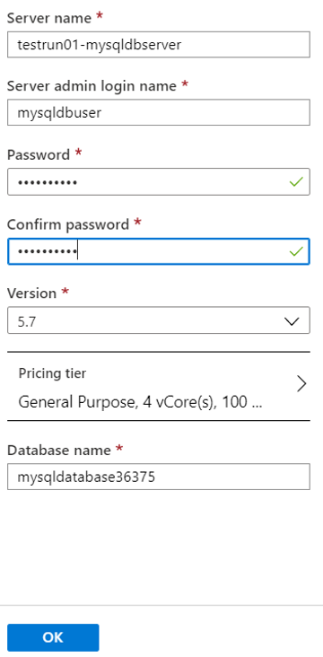
                                     
    - **Application Insights**: Leave at the default configuration.

    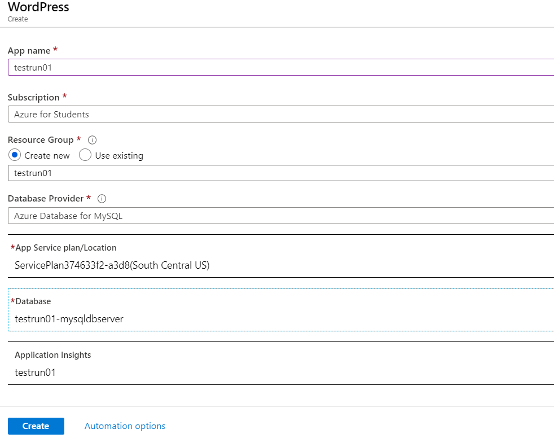

7.	Finally, select the Create button to start the deployment of your new site.

8.	Select the notification bell icon at the top of the portal. If your browser window width is smaller, it may be shown when you click on the ellipsis (...) icon at the top right..

    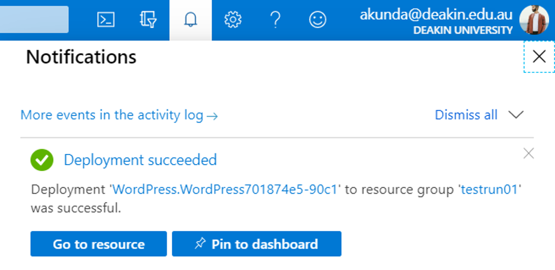
 

9.	If you see this Deployment in process that means it hasn’t been deployed yet. Please allow some time to deploy.
    
    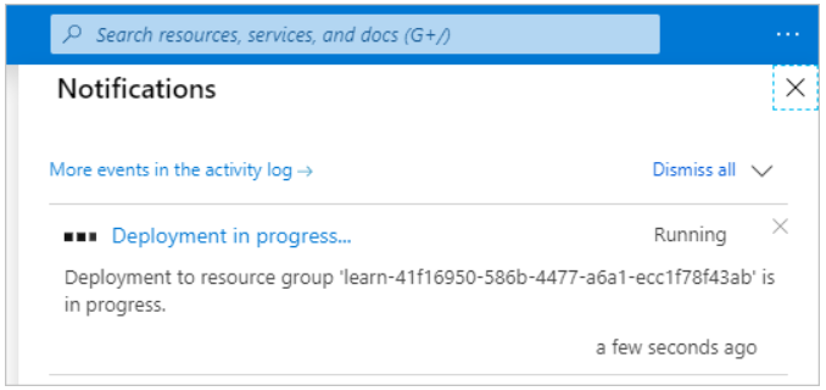

10.	Select Go to resource to navigate to the App Service overview.

    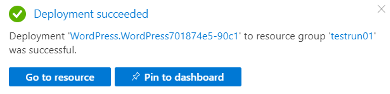
 

11.	You will see bunch of options to play with. You can change the settings as you like now.
  
    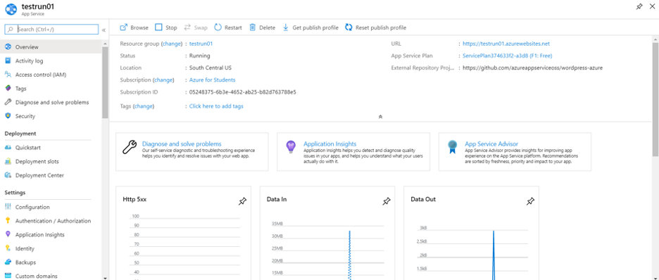

12.	Find the URL in the Overview section.
 
    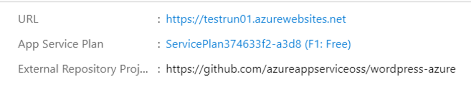

13.	Copy the URL information. Open a new tab in your browser and use the information to browse to your new WordPress site. You can now configure your WordPress website and add content.
  
    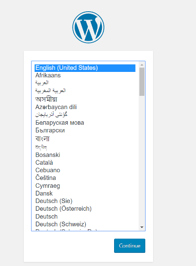

14.	You will need to fill a few more fields to complete the set up.
   
    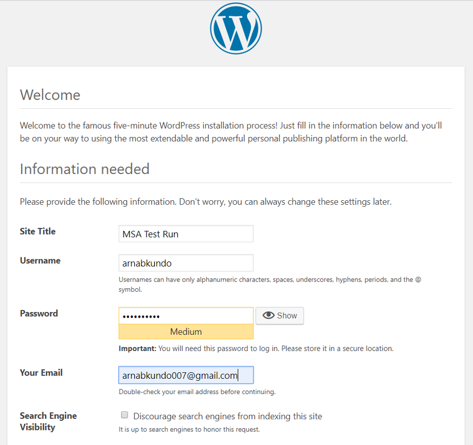

15.	Once it is done you will get a message. Then you can Log in.
   
    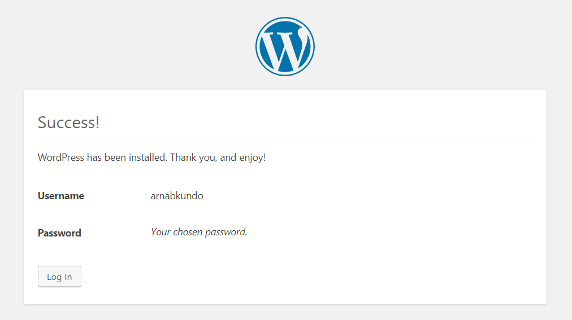
 

16.	After you logged in you can see a lot of options to edit your website. Feel free to use your creativity to decorate your website
  
    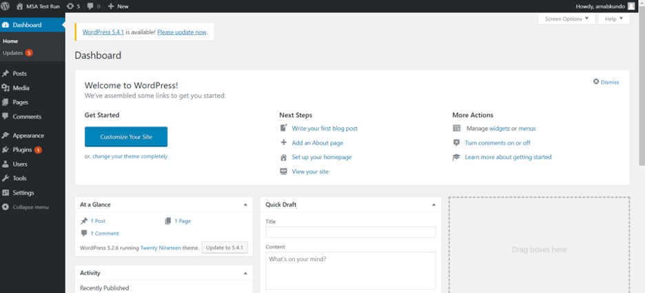

17.	BEST OF LUCK
