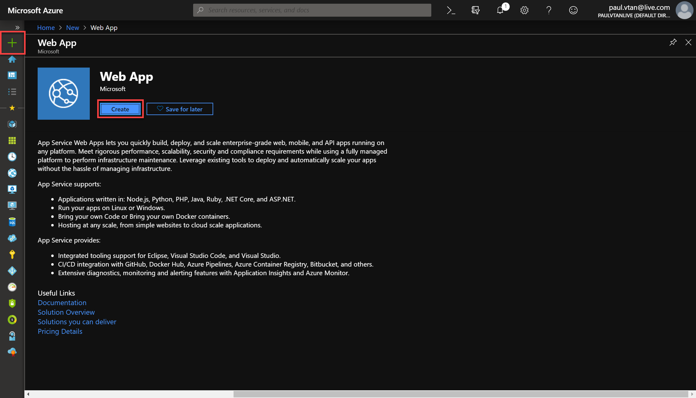
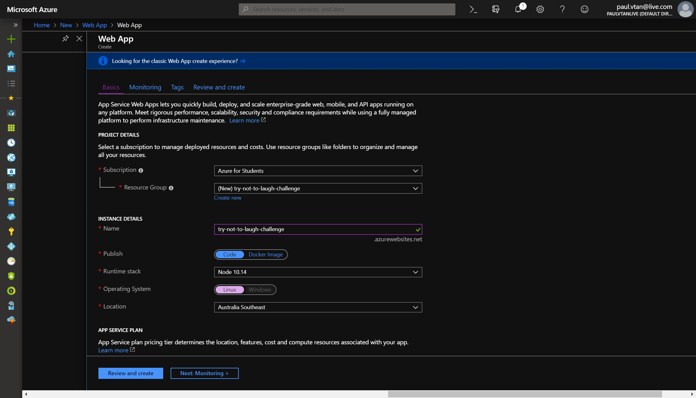
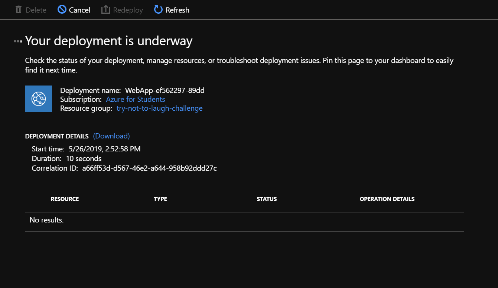
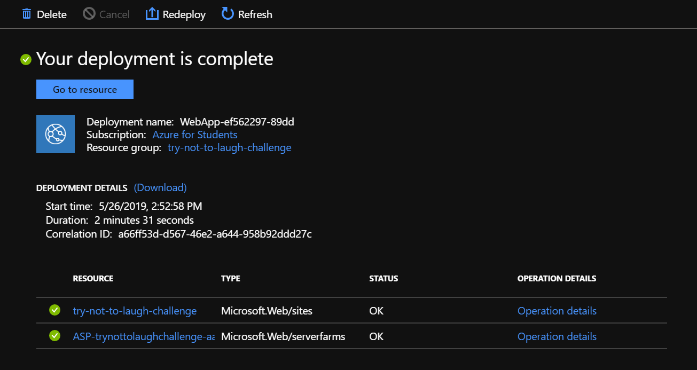
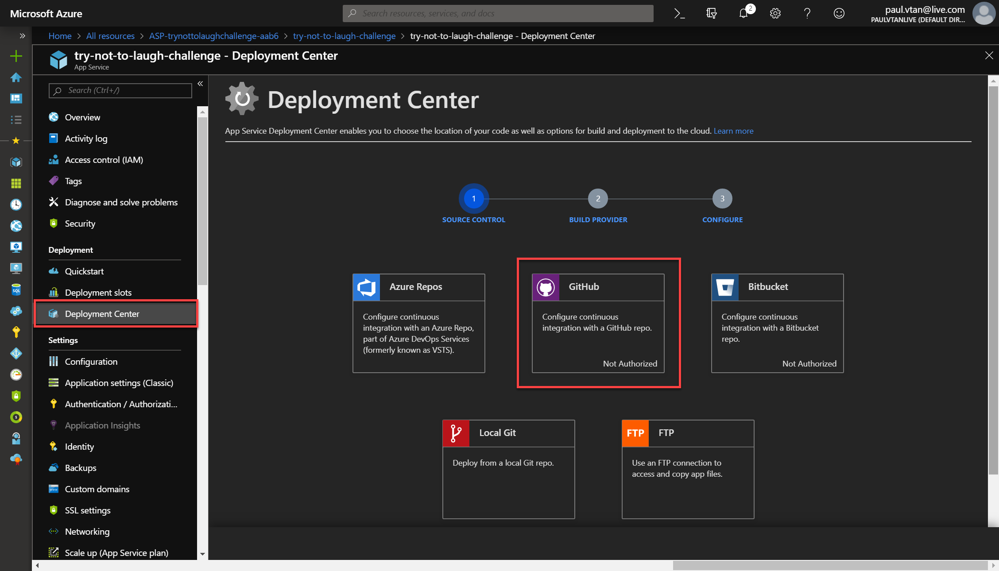
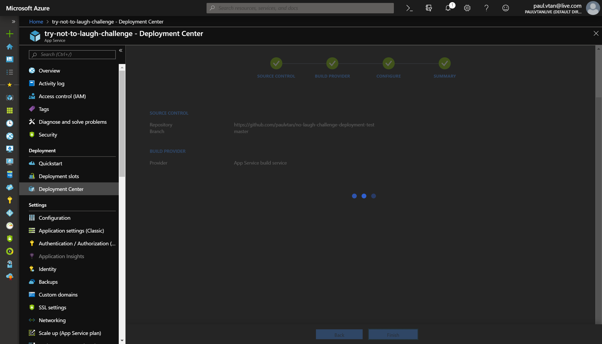

# Azure Deployement

## Introduction

In this quick guide, we will be looking at deploying and hosting our web app using Azure.

1. Login to your **Azure portal** and create a new **Web App** resource.

2. Configure the deployment

**Notes**

* **Publish:** *Code* 
* **Runtime stack:** *Node* 

3. Go ahead and deploy the web app instance.

4. Configure the deployment center.

* Once done, headover to the web app, in the deployment center choose **GitHub**.

* Login and proceed. 

* Select The **App Service build service.**

* Configure the repository and branch of your code. 

* Review then build & deploy.

This will take sometime so sit back and relax for awhile.

5. Navigate back to **Overview** and click on your website **URL**.

### Congratulation, your website is live! 😃

