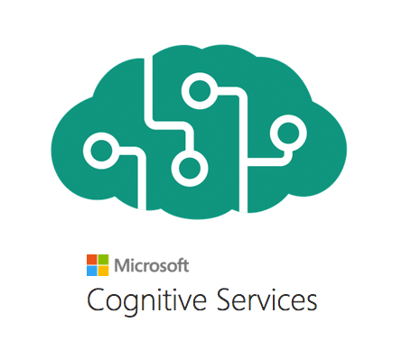
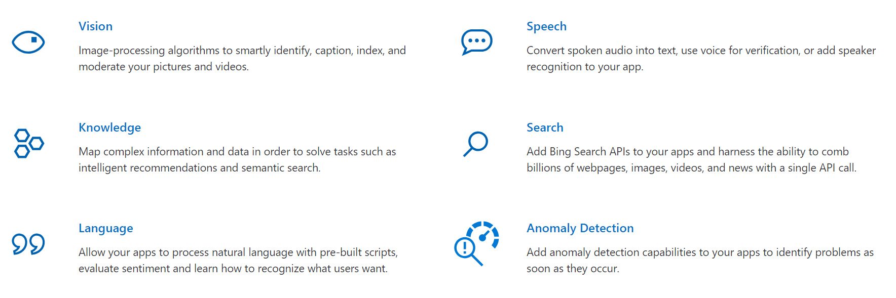
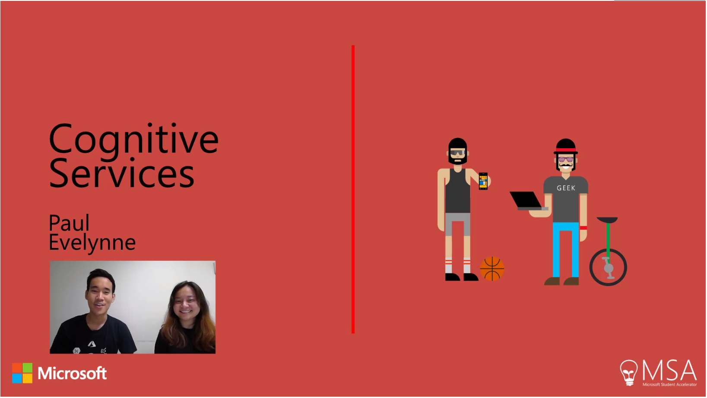
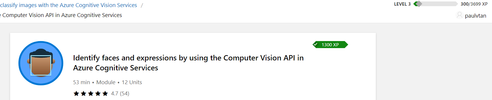

# 😂 Try Not to Laugh Challenge The Game! 😂

Introduction
============

<b>Welcome all!!</b> Whether you are new to programming or a returning veteren, I hope you are excited to learn how you can utilize the power of <b>Microsoft Cognitive services</b> to enhance your web application!

#### *Cognitive Services, what's that?* 

Microsoft cognitive services APIs help empower your apps and websites in many ways. These APIs allows us to easily integrate the power of <b>Machine Learning</b> into your applications using the REST API allowing them to intelligently interact with user in ways we never imagined!

Some of the capabilities cognitive services provide.

🔥<b>Checkout this inspiring app built by a blind Microsoft engineer!</b>🔥

<a href="https://www.youtube.com/watch?v=R2mC-NUAmMk" target="_blank">

</a>

<b>Learn More 💡:</b> [Microsoft Cognitive Services](https://docs.microsoft.com/en-us/azure/cognitive-services/welcome)

## So what am I getting out of this guide?

If you have read to this point I'm glad you are interested! In this module of **MSA 2019**, we will be making a simple React JS web application in form of **'Try not to laugh challenge the game'** *(if you have not heard of this challenge just google it 😛)*. 

Your app will utilize the power of **Vision API** *(Face)* in order to detect and response to player's emotion in **real time!!**

So, basically not only you will learn about building a basic web application in **React JS** *(Which is really popular right now)* and implementing AI capabilities into your web app, you will finish this module with a fully functional web application you can show off to your mates and employers. 👍

## Video Tutorial 

You can also find a complete video walkthrough of the project here. 😊

<a href="https://www.youtube.com/watch?v=5OS_J_mfNYI" target="_blank">

</a>

## Knowledge Requirements

Don't be intimidated, this guide aims to be easy enough for anyone with little to no prior programming experience to follow.

**(However, *passion* is absolutely required!).**

Keep in mind that for the purpose of keeping this guide simple and straight forward as a practical example for demonstrating cognitive services in action, we will not be going into much details around programming. 

It is required that you further study the area where you find yourself lack understanding. As per usual, use [MSA Facebook group](https://www.facebook.com/groups/msaccelerator/) to ask questions, reach out to MSPs, friends but remember to Google for answers first. 😊 

**However skills in following domains will help**

**1. Basic programming (JavaScript).**

&nbsp;&nbsp;&nbsp;&nbsp;&nbsp;&nbsp; 💡 Need a starting point? [Click Here]

  
  - [JavaScript: First Steps](https://developer.mozilla.org/en-US/docs/Learn/JavaScript/First_steps/What_is_JavaScript)
  - [JavaScript: Variables](https://developer.mozilla.org/en-US/docs/Learn/JavaScript/First_steps/Variables)
  - [JavaScript: Mathematical Operations](https://developer.mozilla.org/en-US/docs/Learn/JavaScript/First_steps/Math)
  - [JavaScript: String Manipulation](https://developer.mozilla.org/en-US/docs/Learn/JavaScript/First_steps/Useful_string_methods)
  - [JavaScript: Arrays](https://developer.mozilla.org/en-US/docs/Learn/JavaScript/First_steps/Arrays)
  

**2. React - Class components, Function components, States, Routing.**

&nbsp;&nbsp;&nbsp;&nbsp;&nbsp;&nbsp; 💡 Need a starting point? [Click Here]

  
  - [Read More about React](https://reactjs.org/)
  - [Getting Started with React JS](https://reactjs.org/docs/getting-started.html)
  

**3. Basic understanding of REST API.**

&nbsp;&nbsp;&nbsp;&nbsp;&nbsp;&nbsp; 💡 Need a starting point? [Click Here]

  
  - [REST API Concept - YouTube Video](https://www.youtube.com/watch?v=7YcW25PHnAA)
  

**4. Cognitive Service Face API.**

&nbsp;&nbsp;&nbsp;&nbsp;&nbsp;&nbsp; 💡 Need a starting point? [Click Here]

  
  - [Identify faces with the Computer vision API module](https://docs.microsoft.com/en-us/learn/modules/identify-faces-with-computer-vision/)
  

## Getting Started

Before we get started you will need to equip yourself with the right tools, follow the remaining instruction below to setup your developmnet environment. 

#### *Setting up your development environment*

1. **Visual Studio Code**&nbsp;

      - Visual Studio is a perfect code editor for the job as it's easy to setup and provides great supports for web development.               [Download Visual Studio Code](https://code.visualstudio.com/)

2. **GitHub + Git & GitHub Desktop**  +  

      - We will be using **GitHub**, which utilizes Git for our version control. [Get Started with GitHub & Git here](https://github.com/NZMSA/2017-Phase-1-Module-2/tree/master/2.%20Introduction%20to%20Git)
      
      - **GitHub Desktop** is a handy GUI desktop application, which helps you easily work with your GitHub's repo instead of through Git command line. [Download GitHub Desktop](https://desktop.github.com/)
      
3. **Node.js** 
     
     - Node.js is an open-source, cross-platform JavaScript run-time environment that executes JavaScript code outside of a browser. [Download Node.js](https://nodejs.org/en/)
     
4. **NPM** 

     - npm is a package manager for the JavaScript programming language. It is the default package manager for the JavaScript runtime environment Node.js. Npm comes with Node.js installation, and it allows us to easily create react application from boilerplate code or install other required libraries later on. *(Comes with Node.js)*

5. **Azure Account** 

      - Microsoft Azure is a cloud computing service. To utilize cognitive services APIs to thier full potential, you will need an Azure account, which comes with trial credit.  Headover to [Microsoft Azure](https://azure.microsoft.com/en-us/free/). Students are eligible to signup with student benefits - [Azure for students](https://azure.microsoft.com/en-us/free/students/).

Now that you have your environment setup and ready to go. Read a bit about the submission criteria below to familiarize yourself with what to expect for MSA Phase 1. 

## Submission Criteria 📝

The following are the submission requirements from this Cognitive Services moduel.

#### Web Application utilizing cognitive services

Create a web application utilizing any of the Cognitive Service APIs. The app must be your own and is substantially different from the example demonstrated in this guide, i.e. it cannot be 'Try not to laugh challenge'. 

**Submit the following**

1. Link to your deployed web application on Azure.
2. Link to your GitHub repository. (Make sure the repo is public)
3. Screenshot of your profile showing complete modules from Microsoft Learn platform (Include screenshots in your GitHub repo).

<b>Screenshots</b>

_Screenshot should shows your Microsoft Learn username._

4. [Identify faces with the Computer vision API module](https://docs.microsoft.com/en-us/learn/modules/identify-faces-with-computer-vision/)

Example

5. 1 another module from Microsoft Learn platform that helps you build your app.

Suggestion: [Microsoft Learn: Cognitive Services](https://docs.microsoft.com/en-us/learn/browse/?term=cognitive%20services)

## Where from here?

You are ready to go. Dig in and start coding! Simply follow the 2 parts tutorial in this guide.

#### [Part 1 - **Implementing Video Player.**](/Cognitive%20services/1.%20Implementing%20Video%20Player)

#### [Part 2 - **Implementing Real-time Emotion Analysis**](/Cognitive%20services/2.%20Implementing%20a%20Real-time%20Emotion%20Analysis)

**Good luck and have fun!**

*We would love to hear your feedback. Discuss them on Facebook Group or email us at nzmsa@microsoft.com*

Evenlyn & Paul 😊
