# Web App
## [Introduction](https://medium.freecodecamp.org/when-should-i-use-typescript-311cb5fe801b) 

As developers we more than often will be working in teams, which could mean that our codebase is large, a type system can help you avoid a lot of common errors. This is especially true for single-page applications.

Any time one developer could introduce breaking changes, it’s generally good to have some sort of safety mechanism.

The TypeScript transpiler reveals the most obvious mistakes — though it won’t magically eliminate the need for debugging.

If your codebase isn’t all that big, it probably doesn’t make sense to make it larger by adding type annotations. I’ve converted 180+ files from JavaScript to TypeScript, and in most cases it added roughly 30% to the total code size.

Typescript gives react developers many benefits such as autocomplete, type checking, compile time errors which increases productivity and other refactoring benefits. 

### Learning Outcomes from this module:

* How to create a basic react application with typescript
* How to navigate the terminal within Visual Studio Code
* What are components?
* How to link custom global stylesheets to your entire react application.

# Requirements
During This Section you will need to the following installed
* Visual Studio Code
* Node
* Github Account

# What are we making
Today we will be creating a basic react application to find the age of a person from an image.

# Getting started

Make sure you have npm installed, and updated Run: 

If not follow this to [install](https://www.npmjs.com/get-npm)

```sh
[sudo] npm i -g npm to update  
```

This quick start guide will teach you how to wire up TypeScript with [React](http://facebook.github.io/react/).


We'll use the [create-react-app](https://github.com/facebookincubator/create-react-app) tool to quickly get set up.

We assume that you're already using [Node.js](https://nodejs.org/) with [npm](https://www.npmjs.com/).
You may also want to get a sense of [the basics with React](https://facebook.github.io/react/docs/hello-world.html).

# Install create-react-app

We're going to use the create-react-app because it sets some useful tools and canonical defaults for React projects.
This is just a command-line utility to scaffold out new React projects.

```shell
npm install -g create-react-app
```

# Create our new project

We'll create a new project called `my-app`:

```shell
create-react-app my-app --scripts-version=react-scripts-ts
```

[react-scripts-ts](https://www.npmjs.com/package/react-scripts-ts) is a set of adjustments to take the standard create-react-app project pipeline and bring TypeScript into the mix.

At this point, your project layout should look like the following:

```text
my-app/
├─ .gitignore
├─ node_modules/
├─ public/
├─ src/
│  └─ ...
├─ package.json
├─ tsconfig.json
└─ tslint.json
```

Of note:

* `tsconfig.json` contains TypeScript-specific options for our project.
* `tslint.json` stores the settings that our linter, [TSLint](https://github.com/palantir/tslint), will use.
* `package.json` contains our dependencies, as well as some shortcuts for commands we'd like to run for testing, previewing, and deploying our app.
* `public` contains static assets like the HTML page we're planning to deploy to, or images. You can delete any file in this folder apart from `index.html`.
* `src` contains our TypeScript and CSS code. `index.tsx` is the entry-point for our file, and is mandatory.

# Running the project

Running the project is as simple as running in the console which can be opened by pressing ctrl + ` or going into View in your menu tab and clicking on terminal. 

```sh
npm run start
```

This runs the `start` script specified in our `package.json`, and will spawn off a server which reloads the page as we save our files.
Typically the server runs at `http://localhost:3000`, but should be automatically opened for you.

Every time you save a change to your application it should be automatically rebuilt. This helps us by allowing us to quickly see changes and therefore iterate on a more frequent basis.

After you've run the project for the first time you should be greeted with the following screen.

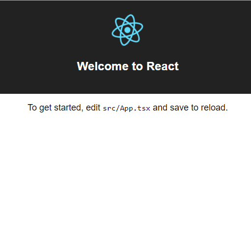

# Starting Coding

Firstly lets begin by removing the code that is currently in ```App.tsx```. You should be left with the following within the file

```JSX
import * as React from 'react';

class App extends React.Component {
  public render() {
    return (
      <div>
        
      </div>
    );
  }
}

export default App;
```

At this point we can also go ahead and delete ```App.css``` and the ```logo.svg``` files as well.

At this point you should go ahead and create a new folder called components which will be used to store all the components that we will be making. Within this folder lets create 3 folders inside for each of the components that we will be making. Go ahead and name these DropArea, Header and Result.

# Coding the Header

One type of react component is called a react functional component which will just be a fucntion that is exported where the function will return some amount of JSX (the thing that looks like html). These types of components are useful when you dont need state.

So lets go within the header folder and create two files one called ```Header.tsx``` and ```Header.css``` these will be used to store the styling and the actual code for the header.

Within the ```Header.tsx``` file add the following code

```JS
import * as React from 'react'
import './Header.css'

export default function Header() {
    return (
        <div className="header">
            <h1 className='headerText'>How Old? 🤔</h1>
        </div>
    )
}
```
```JS
'import './Header.css'
``` 
This line in the code adds on our css file so the styling is applied.

Within the ```Header.css``` file also add the following code to style our header.

```CSS
.header {
    color: white;
    display: flex;
    justify-content: center;
    padding-top: 30px;
  }
.image {
    padding-left: 15px;
    max-height: 100%;
    max-width: 100%;
}
.headerText{
  font-size: 80px;
  margin: auto 0;
  font-weight: bold;
  color: #eeeeee;
}
```
# Coding The Drop Area
Now we need to code up our drop area.

Start by typing  `npm i --save react-dropzone@4.3.0` followed by `npm i @types/react-dropzone@4.2.0` into your integrated terminal. We will be using react-dropzone https://github.com/react-dropzone/react-dropzone in order to have a drag and drop API for our images.

Now that we have the DropArea installed go ahead and create two files within the DropArea folder and call these ```DropArea.tsx``` and ```DropArea.css```

In React you can define components in two different ways.
1. As a function
2. As a class

Declaring a component as a class has its own benefits that we will talk about shortly. 

We now want to start by declaring the interface that the State of the component will adhere to. If you are familiar with object-oriented programming languages "state" is similar to a private field. State is fully controlled and private to the class it is contained in. Only components that are declared as a class will have state in them.

The interface we will define inside your ```DropArea.tsx```, before the component declaration is 

```typescript
interface IState {
  imageFiles: any[],
  dropzone: any
}
```
Where imageFiles are the images that you upload and the dropzone is a special state so that we can bind the current execution context to the state to access later. This is there so that we have the same context even when in an callback function. Don't worry if you don't understand what all of this means, hopefully with more time it will be clear!

```typescript
interface IProps {
    setResults:any
}
```

This is defining the interface for the props of the component. You can basically think of this like the inputs to a fucntion that is we need to specify something under set results.

We now want to initialize our constructor within the ```DropArea.tsx``` file. You should add the constructor and your ```DropArea.tsx``` file should end up looking like this.
```TypeScript
import * as React from 'react'
import ReactDropzone from 'react-dropzone'
import './DropArea.css'

interface IState {
    imageFiles: any[],
    dropzone: any
}

interface IProps{
    setResults:any
}

export default class DropArea extends React.Component<IProps, IState>{
    constructor(props: any) {
        super(props)
        this.state = {
            imageFiles: [],
            dropzone: this.onDrop.bind(this)
        }
    }
```
The constructor is there to initialize the state so that we can access it later.

React Dropzone requires a function to be passed into it to decide what to do with the files that have been dropped inside.

So let's start with the onDrop function. The onDrop's fuunction has the responsibility of displaying the image when dragged and dropped onto the screen.
```TypeScript
    public onDrop(files: any) {
        this.setState({
            imageFiles: files,
        })
        this.props.setResults("",this.state.imageFiles.length)
        const file = files[0]
        const reader = new FileReader();
        reader.onload = (event) => {
            const binaryString = (event.target as FileReader).result;
            if (typeof binaryString === "string") {
                this.upload(btoa(binaryString))
            }
        };
        try{
            reader.readAsBinaryString(file);
        }catch(error){
            this.props.setResults("Sorry we had trouble loading that file please use a downloaded image file",0);
        }
    }
  }
```
So here in the function, we pass in a file, and then we read the image, display it by setting the imageFiles state to files and upload the image using the upload method which we will implement next. The btoa() function encodes the image into a base 64 string.

On side note the line with `const binaryString = (event.target as FileReader).result` is casting the event to be of type FileReader and then it will get the result of the event target.

Dont worry about the setResults function at the moment we will get to those soon enough.

The upload function is next.
```typescript
    public upload(base64String: any) {
        const base64 = require('base64-js');
        const byteArray = base64.toByteArray(base64String);
        fetch('https://whatsmyage.azurewebsites.net/image', {
            body: byteArray,
            headers: {
                'Content-Type': 'application/octet-stream',
            },
            method: 'POST'
        })
            .then((response: any) => {
                if (!response.ok) {
                    this.props.setResults("Sorry there was an error",this.state.imageFiles.length)
                } else {
                    response.json().then((json: any[]) => {
                        if(json.length<1){
                            this.props.setResults("Sorry no face detected",this.state.imageFiles.length)
                        }else{
                            this.props.setResults("Age is "+json[0].faceAttributes.age,this.state.imageFiles.length)
                        }
                    })
                }
            })
    }
```
Here what we do is we send a POST request to the API. The content is the base64 string we encoded previously. After the request has been sent we then guage responses. If the response is not okay we send out an error message to our result component ( which is to come still). Otherwise we convert the response to a JSON object. It could be that the image we sent has no faces and in this case the array which is returned from the api will be empty so we need to check for this. Otherwise we can set the age to the first item from the json object.

We now have the functions that we need, we can now get into writing the actual code for some of the very basic UI.

```javascript
 public render() {
        return (
            <div className="cont">
                <div className="centreText">
                    <div className="dropZone">
                        <ReactDropzone accept='image/*' onDrop={this.state.dropzone} style={{ position: "relative" }}>
                            <div className="dropZoneText">
                                {
                                    this.state.imageFiles.length > 0 ?
                                        <div>{this.state.imageFiles.map((file) => )}</div> :
                                        <p>Try dropping some files here, or click to select files to upload.</p>
                                }
                            </div>
                        </ReactDropzone>
                    </div>
                </div>
            </div>
        )
    }
```

Now lets style it so it doesn't look horrible.

```css
.centreText {
  text-align: center;
}

h1 {
  font-size: 150px;
}

.dropZone {
  margin-top: 20px;
  margin-left: 5%;
  margin-right: 5%;
  padding-top: 5px;
  padding-bottom: 0px;
  height: 51vh;
  background-color: #202125;
  border-radius: 20px;
  color: white;
}

.image1 {
  max-width: 100%;
  height: 50vh;
}

.dank {
  display:flex;
  justify-content:center;
  color: white;
  font-size: 20px;
}

.dropZoneText {
  height: 50vh;
  display: flex;
  justify-content: center;
  flex-direction: column;
  text-align: center;
}
```
This applies some basic styling to our DropArea.

# Coding up the Result Area

Start off by creating a file within the Result folder called ```Result.tsx```.

Start by installing a spinner in your terminal type in npm i --save react-loader-spinner.

npm i and you will install all of the declared dependencies.

We will now go to the `images.d.ts` file and declare the module `react-loader-spinner`. We do this because, in TypeScript everything has be explicitly "typed". Since this is not a TypeScript module, we will have to declare it inside the "typings" file so that the TypeScript compiler does not get upset.

Type the following line into `images.d.ts`
```
declare module 'react-loader-spinner'
``` 

Now lets quickly create the result component.

```tsx
import * as React from 'react'
import Loader from 'react-loader-spinner'

interface IProps{
  result:string
  filelength:any
}

export default class Result extends React.Component<IProps,{}> {
  
  public render() {
    return (
      <div className="dank">
        {
          this.props.result === "" && this.props.filelength>0 ?
            <Loader type="TailSpin" color="#00BFFF" height={80} width={80} /> :
            <p>{this.props.result}</p>
        }
      </div>
    )
  }
}

```
This component just takes two props which is the filelength and result.

Within the div you will notice the following code which is basically checking if the result is an empty string and the filelength is greater then 0. If one of these isnt true then we will load up our spinner wheel to indicate we are still loading. Otherwise we will display the text inside of the result prop. 
```tsx
        {
          this.props.result === "" && this.props.filelength>0 ?
            <Loader type="TailSpin" color="#00BFFF" height={80} width={80} /> :
            <p>{this.props.result}</p>
        }
```

If you noticed we dont include any stylesheets but if you look at the DropArea.css file there is a tag for the result. This is to show you that stylesheets are global and arent limited to one component. So you need to make sure that you names for div's etc are unique across all files.

# Now back to coding up the App
Lets go back into our  `App.tsx` file. Lets add some code so that we can see our components that we created now.

Fistly we need to import the components so add the following code to the top of your ```App.tsx``` file.

```tsx
import DropArea from './Components/DropArea/DropArea'
import Header from './Components/Header/Header'
import Result from './Components/Result/Result'
```

Remember that function we called from DropArea we now will finally get to coding it. So lets first add some state to our application file. Add the following interface and constructor to our `App.tsx` file.

```typescript
interface IState {
  result:string
  filelength:number
}

class App extends React.Component<{},IState>{
    public constructor(props:any){
      super(props)
      this.state = {
        result:"",
        filelength:0,
      }
    }
```
Just like before this is just setting up what we want from our state and then initalizing the state.

Lets add a function so that we can set the state from our DropArea component to do this lets add the following function to the bottom of the file

```typescript
    public resultstate = (resultString:string,filelen:any) => {
      this.setState({result:resultString,filelength:filelen})
    }
```

This is an arrow function which means that it will reference the current class. If we used a normal function to the constructor we would have had to add the following `this.resultstate.bind(this)`. Which would have the same effect as the arrow function.

Now lets wrap up this project by adding the components that we made to our render method

```typescript
  public render() {
    return (
      <div>
        <Header />
        <DropArea setResults={this.resultstate} />
        <Result result={this.state.result} filelength={this.state.filelength} />
      </div>
    );
  }
```
For DropArea we need to pass in our function that we just created. The result area also needs two props which are the state of the `App.tsx` . 

Finally lets add some styling to the background to make it dark mode lets do this by adding the following to `index.css`. (The only code in the index.css file should be what is below.)

```css
body {
  margin: 0;
  padding: 0;
  font-family: Helvetica, sans-serif;
  background-color: #323639;
}
```

# Congrats now you can see your beautiful application


# Deployment

Now its time to show the whole world what you've just built! In this section, we're going to deploy our web app to Microsoft Azure Web App.

Before you begin, make sure you have done the following
-  Activated Azure for Students by following the steps [here](https://github.com/NZMSA/2019-Phase-1/tree/master/Azure%20For%20Students)
- Created a [GitHub](https://github.com/) account (if you're new to Git and GitHub, [watch this video](https://www.youtube.com/watch?v=lE3eIlMpUu0))

## Step 1: GitHub Repository Setup
### Installing Git
To install git, head over to this [link](https://git-scm.com/) and download the latest version of git

### Setting up a GitHub Account
Head over to [GitHub](https://github.com/) and create a new account if you don't have one already

(Tip: If you are a student, you can get unlimited private repositories for your personal projects! Checkout [GitHub Student Pack](https://education.github.com/pack) )

## Step 2: Create a Repository
Open up GitHub and create a 'New Repository' by clicking on the 'plus' icon on the top right corner of the screen

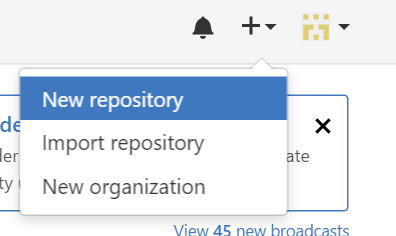

Give your repository a name and description. 

You choose to keep the repository public (others can see the source code) or private. But for your submission for MSA, you need to keep the repo public.

You can also choose to 
* initialise with a README 
* add a gitignore for Node (which will ignore certain files that don't need to be uploaded) 

When you are ready, press 'Create repository'

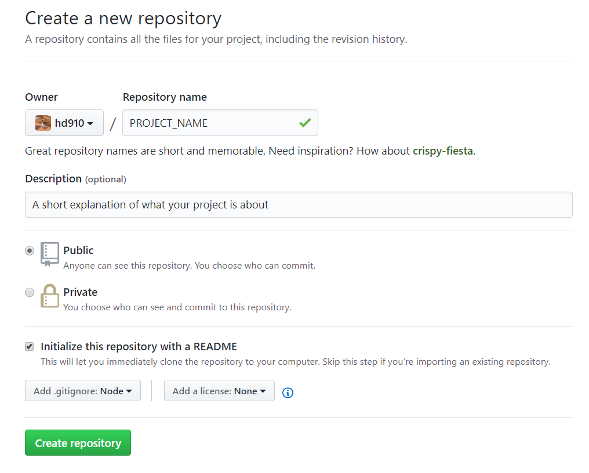

## Step 3: Clone Repository
On the main page of your GitHub repository, click 'Clone or download'

Copy the URL
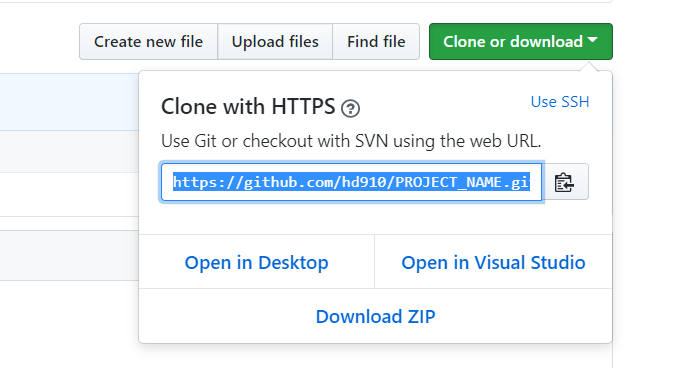

Open up command prompt and navigate to a directory where you want to store your github files (e.g. C:\Users\Hayden\Documents\GitHub\)

Hint: See below on how to navigate using command line

When you are in the directory, type `clone https://github.com/YOUR_ID/YOUR_GITHUB_LINK` (the link you copied earlier)

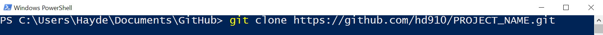

## Step 4: Copy over project files
Open up your file explorer and navigate to the directory where you cloned your repository files (for me it is C:\Users\Hayden\Documents\GitHub\PROJECT_NAME)

Move your entire project files and folder here  
(Note: your project files and folder will look different to the screenshot)

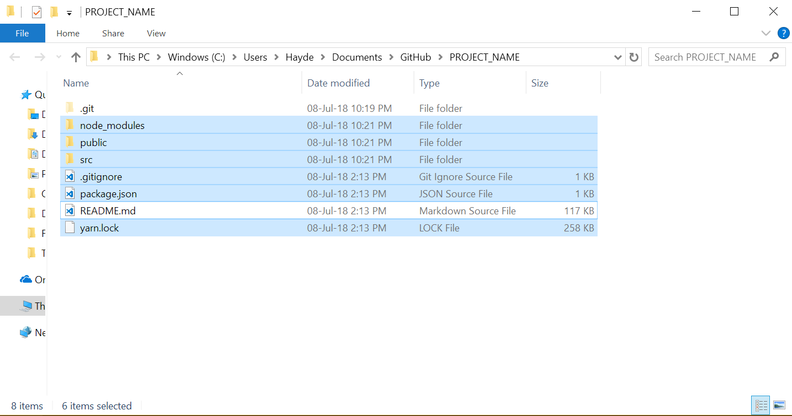

## Step 5: Push changes to GitHub

Back to cmd go into the newly created repo folder (e.g. `cd PROJECT_NAME`) and type `git status` and you will see that there are many files are 'untracked'  
(Hint: Make sure you are inside the project folder or else you'll get an error)

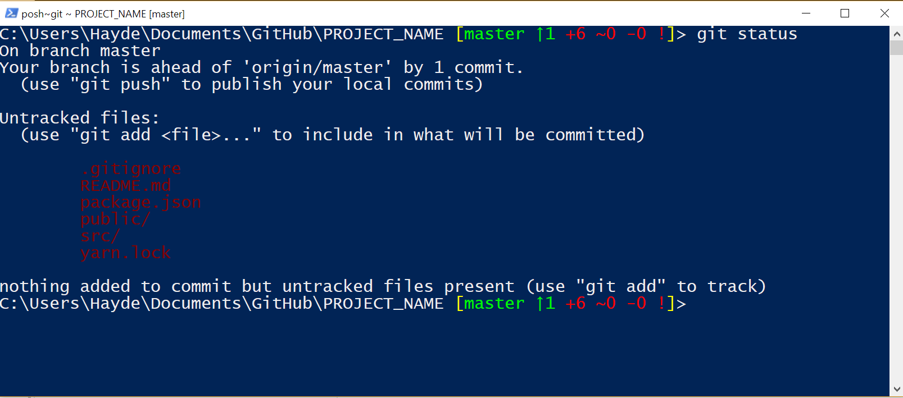

To add the files and folder, type `git add -A` which will add all the untracked files as shown in red.

Now if you type `git status`, you'll notice that all the files are now green 

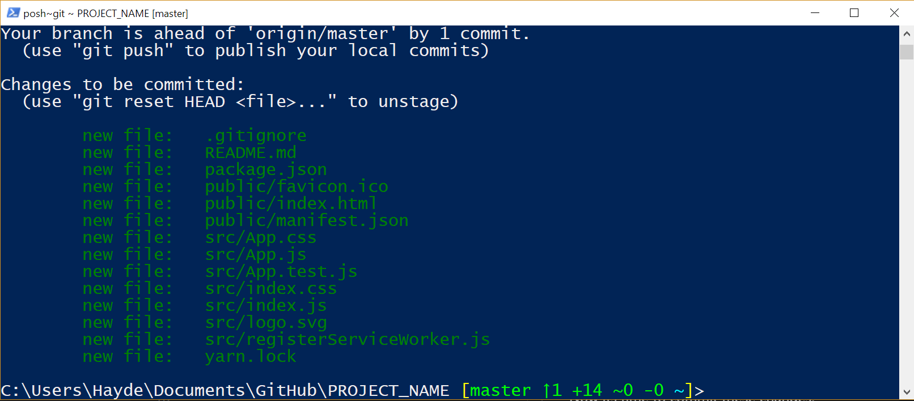

Now its time to commit these changes. 

Type in `git commit -m "Add project files and folders"`

To upload these changes to GitHub, type `git push`

If you see something like this, you have successfully uploaded your files to GitHub!

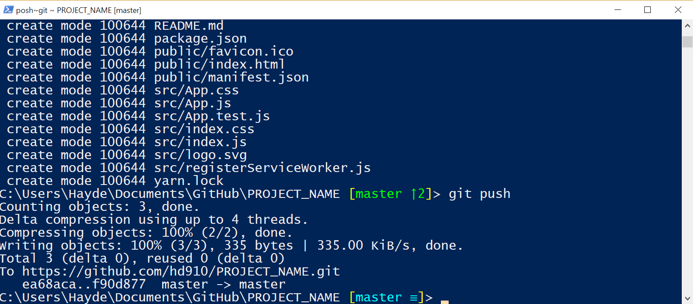


## Step 6: Create an Azure Web App
Navigate to [Azure Portal](https://portal.azure.com) and log in

We want to create a Web App. To do that, press '+' -> Web -> Web App

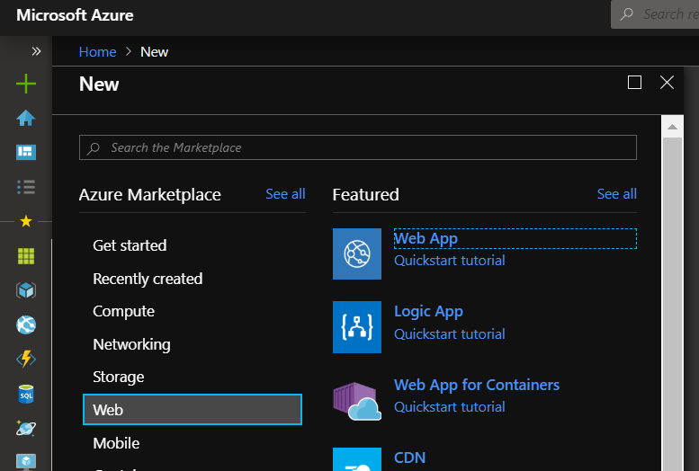

Fill out the form with the app name (which will become your web url) and subscription (your subscription name will be different to what you see in this screenshot). Also change runtime stack to node.js. Leave the rest as default and click 'create'.

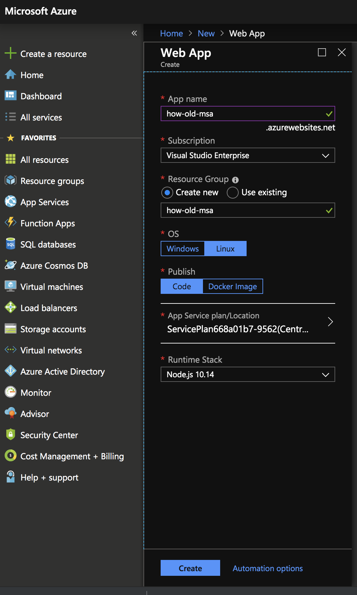

Now sit back and rest while Azure creates your web app!

## Step 7: Deploy web app from GitHub
Once Azure is done creating the web app, open the resource by going to App Service (under favourites) and select your web app

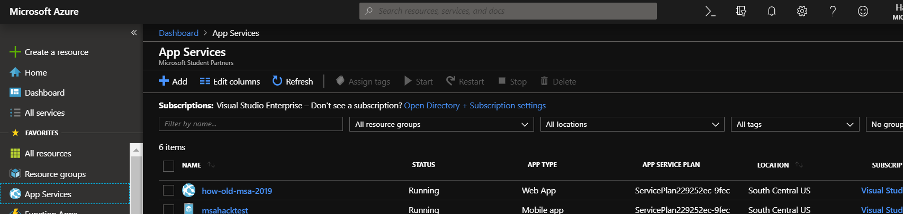

From here, click on 'Deployment Center' and select 'GitHub'. (You will need to connect your GitHub account with Azure)

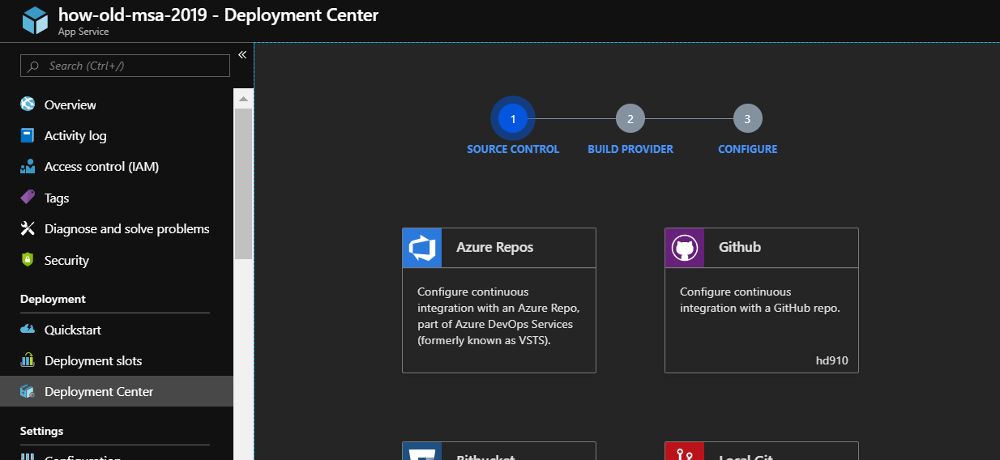

For build provider, keep the default and press continue.

For configure, select the correct GitHub repo and select `master` for branch.

Review the summary and continue.

Azure will now fetch the latest code from GitHub and automatically build the project and deploy!

## Step 8: Check your web app!

Once the build is complete, if you navigate to your web app `https://YOUR_WEB_APP_NAME.azurewebsites.net` you should see your web app live in action!

Now everytime you push your changes to GitHub, Azure will automatically build and deploy!

## Step 11: Congratulations! 🎉

You have successfully uploaded your web app to Azure! 🎂


# Assignment
For your assignment, you will need to create this web app and deploy to Azure. But rather than just copy pasting what we've got here, you will need to customise the look and feel of the page. This could be as simple as changing the theme from dark mode to light mode or changing the layout around.

You will need to submit your GitHub repo url, azure web app url, and submit screenshots to show that you've completed the Microsoft learn video (below). Submissions will be done through the portal that we will provide to you.


### Learn videos
1. [Microsoft Learn - Build a simple website](https://docs.microsoft.com/en-us/learn/modules/build-simple-website/?fbclid=IwAR2WwQj5XVBffvbMuEQdFxiNutvb6T7q4_8q-e-uagi1Tixhrwzjt48D5E0)

Checklist
- Code available on GitHub (submit GitHub repo url)
- App deployed to Azure (submit Azure web app URL)
- Customized UI (e.g change in theme, layout etc)
- Microsoft learn video (submit screenshot)
