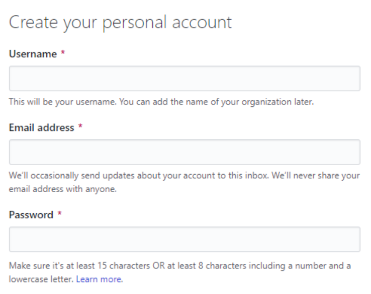
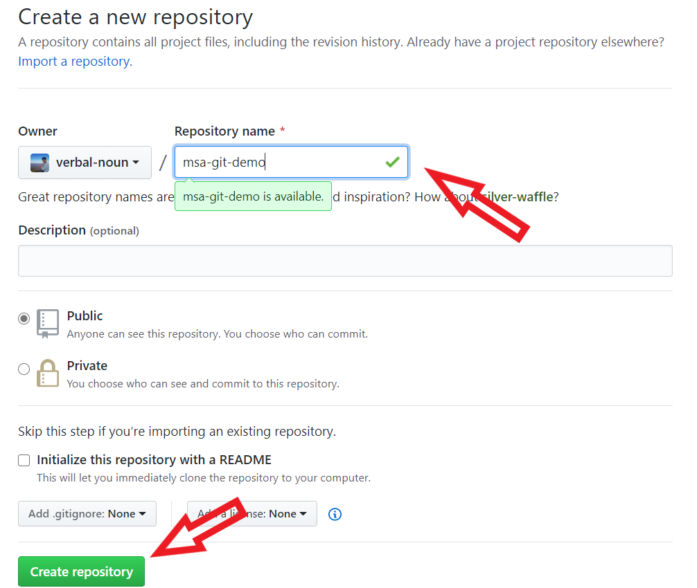

# GitHub Handbook 
Git is used to store projects inside *repositories* and track the complete history of all changes to the project code. Using GitHub, we can upload a local project repository to a remote cloud-based GitHub repository. We can also interact with public repositories published by other developers.

> GitHub could even be looked at as a social networking website for developers. Users can follow each other, give ratings, collaborate and communicate.

GitHub allows developers to utilize, change or improve software from its repositories. Each repository contains all project files and the code history. Repositories can have multiple collaborators and can be either public or private.

GitHub is also a popular way developers to publish their project portfolio online. It's an easy way to showcase skills and experience to potential employers or clients.  It's an important technology to be familiar with, especially for a new developer who is just starting out.

> GitHub homepage: [github.com](http://github.com)


## Getting started with GitHub 

GitHub allows developers to access a **remote** central repository hosted on the internet. A developer can clone(basically download) the hosted remote repository to their computer and work on a local version of the project. They can work on the code or develop new features on their local computer and whenever they're ready, those changes can be pushed to the remote repository hosted on GitHub, where other developers or team members can download it to their computer and stay synchronized with the project development.

Before we can start using GitHub, we need to register our own GitHub account.

To register a new account, visit [GitHub.com](http://github.com) and find the 'Sign up' option on their website, or visit this page directly: [**https://github.com/join**](https://github.com/join)

- **Step 1: Set up your account**

Choose your new GitHub **username**, specify your existing **email** address (it's important to use your real email address because we will need to verify our account when we finalize the registration process) and the **password** of your choosing.



After that, verify your account and you should be able to click the **'Create an account'** button at the bottom.

- **Step 2: Choose your subscription**

In the second step, you can choose the **Free** subscription plan to use GitHub free of charge.

After choosing the **Free** plan, click the **'Continue'** button to go to the next step.

- **Step 3: Tailor your experience**

This is an optional step where you can share some information about yourself if you want to. Otherwise, you can scroll down the page and skip that step to continue the registration process.

> Finally, you need to check the inbox of the email that you provided to **verify your email address** with GitHub.

## Using GitHub 
# 3. Using GitHub

**Common Workflow: Push an Existing Repo to Github**

1. Add/commit your code locally
2. Go to Github and make a new repository
3. Connect your local repo to the github repo (add a remote)
4. Push your code up to github using the new remote

The first thing we will do is create our local repository which we want to push to GitHub. In these notes, we'll create a very simple project repository to demonstrate how it can be uploaded to GitHub.

- **Step 1: Create a new local Git repository**

Based on what we learned in Git Handbook, open up your terminal and navigate to your projects folder, then run the following command to create a new project folder and navigate into it:

```bash
mkdir hello-world
cd hello-world
```

Then, to initialize a new local Git repository we need to run the `git init` command:

```bash
git init
```

After you run that command, you should get feedback that an empty Git repository was initialized for your project.

- **Step 2: Adding a new file to our Git repository**

Create a new file in your project folder, we will call our sample file `README.md`

You can use the graphical interface of your operating system to create the file, or use the following terminal commands:

> Windows Powershell: `ni README.md`
>Bash (Mac/Linux) terminal: `touch README.md`

Save the file changes and then switch back to your terminal window.

- **Step 3: Making our initial commit to the local repository**

As learned in Git Handbook, run the following commands to track your files and make the initial commit in the local repository: 

```bash
git add .
git commit -m "Initial commit"
```

When that's done, it means that we successfully prepared our new local repository to be pushed to GitHub!

Make sure to use the `git status` command frequently when working with Git. It's a great way to check the status of your project files and the whole repository.

#### Creating a new GitHub Repository 
To create a new GitHub repository, navigate to [github.com](http://github.com) and press the plus symbol in the top-right corner, then select the '**New repository**' option, as shown in the screenshot here:



You can also navigate to the GitHub page for creating new repositories by visiting this link: https://github.com/new

> INSERT IMAGE 

On that page, we first need to specify a **Repository name** and an optional **Description.**
For the **Repository name**, we can specify the same project name (**hello-world**) as the local repository that we are using in our example. If you want, you can also write a **Description** of your repository, but you can also skip that field as we did in the screenshot above.

You can set your repository to be **Public** or **Private**.

If you choose **Public**, it means anyone can see this new repository. When uploading your code to a public directory, always make sure that it does not contain any sensitive data that you don't wish to share with others.

On the other hand, if you choose **Private** then you can manually choose who can access the new repository.

If you wanted, you could initialize the repository with a **README** file, which usually contains information or documentation about the project. We don't need one for this simple project, so we can skip those options and click the green **'Create repository'** button to finalize the creation procedure.

#### Pushing code to the GitHub repo 
After the last step, you will be forwarded to the starting page of your new GitHub repository that looks like this:
> Insert Image 

Since we've already created our Git repo locally, we can focus on the **`…or push an existing repository from the command line`** section of the page.

If we didn't already have a local repository created, then we would follow the first set of commands to create a local repository from the remote GitHub one that was just created.

The **git remote add origin** command will associate our local repository with the remote GitHub repository that we just created.  We're essentially telling your Git repo that we have a URL we want it to know about, and we give it the name "origin".  You do not have to name the remote "origin" but it is standard if you only have a single remote.

The **git push** command will then push our local Git repository code to the remote GitHub repository (if you chose a public repository, this will publish your code on the internet - via GitHub).

Therefore, switch back to your local terminal and run the specified commands from your project folder:

```bash
git remote add origin https://github.com/<your-username>/<your-repo-name>.git
git push -u origin master
```

When you run the **git push** command you will be prompted to enter your GitHub username and password, to log in to your GitHub account from the terminal.

After the repository was pushed, you can navigate back to your GitHub account page or the repository link and refresh it: `https://github.com/<your-username>/<your-repo-name>`

Now, you can use that link to share your project repository with other people.

> INSERT IMAGE 

For example, anyone can click on the **hello.js** file to see the contents of our project files.

Also, other developers can **clone** the remote repository to their local computer (or **download** it), by clicking on the green button highlighted in the screenshot.

You can also see many other data from the repository, including past **commits**, existing **branches**, etc.

#### Making changes to the GitHub repository

Now, any changes that we make to our local project files won't automatically affect the remote GitHub repository, until we **push** those changes again, to update it.

For example, open the **hello.js** file with your favorite code editor and change the code to this:

```jsx
console.log("Greetings, World!");
```

Save the file changes, and commit those changes to your local repository using the following commands:

```bash
git add .
git commit -m "Change greeting"
```

Then, push your updated local repository to the remote GitHub repository with this command:

```bash
git push origin master
```

After that, when you navigate back to your remote repository page on [github.com](http://github.com), you should see the updated code, and one more **commit** in the list.

#### Cloning an existing GitHub repository

Another approach would be to first create a GitHub repository online, and then download it to our computer and initiate the project that way.

From [github.com](http://github.com), go to the **New repository** page: [https://github.com/new](https://github.com/new)

Go through the same steps but specify a new repository name:

> INSERT IMAGE 

To clone the repository, visit its page and select the green 'Clone or download' menu button, then click on the icon shown in the screenshot to copy the repository URL that we will need to use:

> INSERT IMAGE 
Then, to clone the remote repository to your computer, execute the **git clone** command with the link that you just copied:

```bash
git clone <github-repo-link>
```

That will create a new folder with the remote GitHub repository name and download all the project files and repository data into it. You can then change directories (**cd**) into that folder and normally continue working on the project, as we learned in the previous example.

You can also clone public GitHub repositories from other developers using the same steps where you first find a copy the repository URL and then use it in the **git clone** terminal command.

## Branching and Merging 
The general rule is that the **master** branch of your GitHub repository should always contain working and stable code. However, you may want to also push some code that you are currently working on, which may be unstable or not fully tested. Usually, that happens when you are adding a new feature to your code, but still want to push that code to GitHub.

With branching, we can create a separate copy of our project code, without touching the **master** branch which holds our stable code. We can make a new branch that creates a separate version of our code, which we can then work with to implement our feature. Then, when we fully integrate and test our new feature, we can merge it back to our **master** branch.

#### Pushing a branch to GitHub 
So, when we are working on code modifications or a new feature locally, we usually want to create a new branch for that feature, so we don't make changes directly on the main **master** branch, which should only contain stable code.

For example, if we wanted to add a new file to our **hello-world** project, you can switch to a new branch by typing this from the project folder:

```bash
git checkout -b new-feature
```
Then, you can create a new sample file called **example.js**, and add the following code:

```jsx
console.log("New greeting!");
```
After that, run the standard steps to commit the new changes to the **new-feature** branch:

```bash
git add .
git commit -m "Add new greeting"
```

To push the **new-feature** branch to the **hello-world** remote repository on GitHub, run this command:

```bash
git push origin new-feature
```
If you refresh the **hello-world** GitHub repository page, you will see that there is a new branch pushed:

> INSERT IMAGE 

#### Creating a Pull Req 

We create a pull request to notify the project owner (or the team leader) that we want to implement some changes from our custom branch to the main **master** branch.

The pull request will allow developers to review and verify the changes, before allowing them to be applied to the **master** branch, which usually only holds the **stable** version of our code.

To create a pull request, we need to press the following button (from the same interface shown in the last screenshot):

> INSERT IMAGE 

After that, we will be redirected to a page that allows us to open a pull request. There, we can specify the title of our pull request and leave a comment describing the changes we have made:

> INSERT IMAGE 

To submit your pull request, click the green **'Create pull request'** button, as shown in the screenshot.

After that is done, other collaborators can review the pull request, analyze the code changes directly, and add their comments about the pull request.

When the changes from the request are reviewed by yourself (or other team members if you are not working alone) and they don't have any conflicts with the **master** base branch, then the pull request can be approved and merged:

> INSERT IMAGE 

After you merge the pull request, it offers to delete the *new-feature* branch since the code is now added to the **master** branch.

After a successful merge, you should see the changes on the **master** branch, and the commits from the custom (*new-feature*) branch will also be added to the **master** branch.

>> Keep in mind that in some scenarios the branch can have conflicts with the base branch, so the button may not be green. This happens where there is a change in a file that conflicts with a different file, so Git cannot automatically decide which version to use. In this situation, a developer may need to manually review the code and solve the conflicts in order to finalize the merge.

Also, if you are the only person working on the project (or in a very small team where you don't have a specified project leader), then you may not need to go through the process of creating a pull request via GitHub to integrate your changes. However, it still may be a good practice to have a complete history of the project updates listed as pull requests.

Check the following GitHub guides:
- [Understanding the GitHub flow](https://guides.github.com/introduction/flow/)


#### Pulling changes from GitHub 
After making changes or merging branches via pull requests on GitHub, the remote repository may look different from the local repository on your computer. To get the latest changes from the remote GitHub repository, we use the **git pull** command.

When we are working on a team project which is hosted in a remote GitHub repository, we want to use the **git pull** command to get the latest version of the code in our **master** branch, which may have been updated by other developers in our team.

If we associated the GitHub remote repository link to the **origin** alias (like we did in the **hello-world** repository example), then we can use the following command to pull any changes from the remote repository to the main **master** branch in our local project:

```bash
git pull origin master
```

When we are up to date with the remote branch, we can then work to further develop the project code or add new features.

## Forking projects on GitHub 
When using GitHub, you may find yourself wanting to use someone else's repository as a starting point of your project. Also, you may want to contribute to a third-party project, which is very popular in the open-source community. Contributing to other projects can also be a great way to build your knowledge and experience, as well as your portfolio!

The process where we create our copy of someone else's project is called **forking**.

So, a **fork** is your personal copy of a repository owned by someone else.

If you are looking to contribute to a project, you can create new *pull requests* from the **forked** project to offer your changes to the owners of the original repository.

#### Forking a repository

There is a sample repository called *Spoon-Knife* hosted by GitHub, which they created for testing purposes: [https://github.com/octocat/Spoon-Knife](https://github.com/octocat/Spoon-Knife)

We will be using this repository to test the **Fork** feature of GitHub. Go to the repository page by following the link above and click the '**Fork'** button, as shown in the screenshot below:

> INSERT IMAGE 

#### Working with a forked repo on your local machine 
To clone the forked repository, visit its page from your GitHub profile and select the green 'Clone or download' menu button, then click on the icon shown in the screenshot to copy the repository URL that we will need to use:

> INSERT IMAGE 

Then, to download the remote repository to your computer, execute the **git clone** command with the link that you just copied:

```bash
git clone https://github.com/<your-username>/Spoon-Knife.git
```

That will create a new folder called *Spoon-Knife* and download all the project files and repository data into it. You can then change directories (**cd**) into that folder and start working on the project.

After making changes or implement new things to the forked project, you can normally add and commit those changes as you would do for any other repository.

Also, you can push the changes that you made to the forked (remote) repository tied to your GitHub account.

#### Proposing changes to the original project 

After you made changes to the project which could  potentially benefit the original project that you forked and you want to help improve the open-source community, you can consider offering to contribute your changes.

This can be done using a similar procedure that we went through in the last section, by creating **pull requests** to the original project repository.

After pushing the changes that you made to your fork, you can create a **New pull request**: 

> INSERT IMAGE 

That will lead you to the new pull request page where you can also add information about your changes.

In situations where you are trying to contribute to a third-party project of a developer that you don't know, it's especially important to provide a good detailed description of everything that you've done. Based on that and the code changes, the original project owner can decide if they want to implement your changes to their project.

After adding information about your changes, you can finally send a new pull request to the original project owner.

## Concluding words

GitHub offers the possibility to have a centralized remote repository when using Git with our project. We can publish our projects and efficiently work with other developers and teams using GitHub. We can also browse all the available open-source projects on GitHub, use them to create our projects or contribute to someone else's project.

To learn more about GitHub and it's powerful features, check their Help page and Guides:

- [https://help.github.com](https://help.github.com/)
- [https://guides.github.com/](https://guides.github.com/)

GitHub also has [a desktop application](https://desktop.github.com/) which offers a graphical user interface when working with their service. However, it's a much less popular method of using GitHub (compared to the command-line interface using a terminal).

Also check **GitHub Gist**, which is an easy way to share your code, notes or other snippets: [https://gist.github.com/](https://gist.github.com/)

**GitHub Pages** is a popular service for hosting web pages via GitHub. You can learn more about it here: [https://guides.github.com/features/pages/](https://guides.github.com/features/pages/)

They also have official video guides which you can find [on this link](https://www.youtube.com/githubguides).